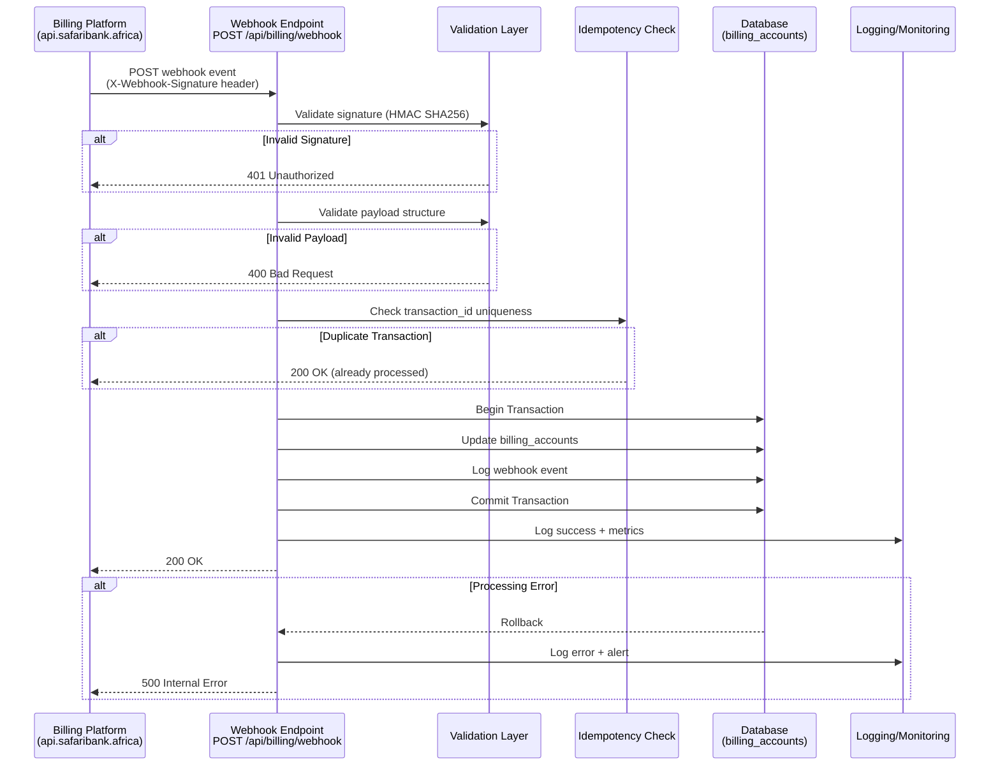

# SafariChat Billing Webhook Implementation Plan

**Version:** 1.0  
**Date:** January 2026  
**Status:** Assessment & Enhancement Required  
**API Documentation:** https://api.safaribank.africa/api-docs

---

## Table of Contents

1. [Current State Assessment](#1-current-state-assessment)
2. [Architecture Overview](#2-architecture-overview)
3. [Security Implementation](#3-security-implementation)
4. [Event Handling](#4-event-handling)
5. [Idempotency Strategy](#5-idempotency-strategy)
6. [Database Schema Enhancements](#6-database-schema-enhancements)
7. [Error Handling & Retry Logic](#7-error-handling--retry-logic)
8. [Testing Strategy](#8-testing-strategy)
9. [Monitoring & Alerting](#9-monitoring--alerting)
10. [Production Deployment Checklist](#10-production-deployment-checklist)
11. [Implementation Roadmap](#11-implementation-roadmap)

---

## 1. Current State Assessment

### 1.1 Existing Implementation

**Location:** `app/Http/Controllers/Api/BillingWebhookController.php` (465 lines)  
**Route:** `POST /api/billing/webhook`  
**Endpoint:** Receives webhooks from `https://api.safaribank.africa`

### 1.2 Current Capabilities ✅

- **HMAC SHA256 Signature Validation** using `X-Webhook-Signature` header
- **7 Event Handlers:**
  - `payment.success` - Activates subscription + adds AI credits
  - `payment.failed` - Logs failure without status change
  - `subscription.created` - Same as payment.success
  - `subscription.renewed` - Extends expiration, increments credits
  - `subscription.cancelled` - Sets status to cancelled
  - `subscription.expired` - Sets status to expired
  - `credits.purchased` - Standalone credit purchase
- **Database Transactions** for data integrity
- **Comprehensive Logging** on all operations
- **Smart Date Handling** for renewals (extends from current expiry if still active)
- **Flexible Account Lookup** via business_id or customer_id

### 1.3 Critical Gaps ❌

| Category | Issue | Risk Level | Impact |
|----------|-------|------------|--------|
| **Idempotency** | No duplicate webhook prevention | 🔴 HIGH | Multiple credit additions for same payment |
| **Audit Trail** | No webhook event logging table | 🟡 MEDIUM | Cannot investigate webhook delivery issues |
| **Schema Mismatch** | Controller references non-existent DB fields | 🔴 HIGH | Runtime errors on webhook processing |
| **Rate Limiting** | No throttling on webhook endpoint | 🟡 MEDIUM | Vulnerable to webhook flooding |
| **IP Whitelisting** | Accepts webhooks from any IP | 🟡 MEDIUM | Anyone with secret can trigger webhooks |
| **Testing** | No automated tests | 🔴 HIGH | Cannot verify webhook behavior |
| **Validation** | Minimal payload validation | 🟠 MEDIUM-HIGH | Could process malformed data |
| **Monitoring** | No alerting on failed webhooks | 🟠 MEDIUM-HIGH | Silent failures in production |
| **Development Bypass** | Skips signature validation locally | 🟡 MEDIUM | Security risk if deployed to staging |

### 1.4 Schema Issues Requiring Migration

The webhook controller attempts to update fields that **don't exist** in `billing_accounts`:

```php
// ❌ MISSING FIELDS (referenced in BillingWebhookController.php)
'subscription_status'      // Used in all handlers
'last_payment_at'         // Lines 115, 145, 294, 410
'last_payment_amount'     // Lines 146, 411
'last_transaction_id'     // Lines 147, 412
```

**Current Schema Fields:**
```sql
status                     // ✅ EXISTS (but controller uses subscription_status)
subscription_started_at    // ✅ EXISTS
subscription_expires_at    // ✅ EXISTS
last_billing_date         // ✅ EXISTS
next_billing_date         // ✅ EXISTS
```

---

## 2. Architecture Overview

### 2.1 Webhook Flow Diagram



### 2.2 Supported Event Types

| Event | Trigger | Action | Credits | Subscription |
|-------|---------|--------|---------|--------------|
| `payment.success` | Payment completed | Activate subscription | ✅ Add | ✅ Set expiry |
| `payment.failed` | Payment declined | Log only | ❌ No change | ❌ No change |
| `subscription.created` | New subscription | Same as payment.success | ✅ Add | ✅ Set expiry |
| `subscription.renewed` | Renewal payment | Extend expiration | ✅ Increment | ✅ Extend expiry |
| `subscription.cancelled` | User cancelled | Update status | ❌ No change | ⚠️ Set cancelled |
| `subscription.expired` | Expiry date passed | Update status | ❌ No change | ⚠️ Set expired |
| `credits.purchased` | Standalone credit buy | Add credits only | ✅ Add | ❌ No change |

### 2.3 Expected Webhook Payload Structure

```json
{
  "event": "payment.success",
  "timestamp": "2026-01-24T12:34:56Z",
  "customer_id": 123,
  "business_id": 456,
  "subscription": {
    "plan_id": "premium_monthly",
    "duration_days": 30,
    "ai_credits": 10000,
    "features": {
      "max_contacts": 1000,
      "whatsapp_channels": 3,
      "customer_followups": true,
      "booking_calendars": true,
      "sales_reports": true
    }
  },
  "payment": {
    "transaction_id": "TXN123456789",
    "amount": 49.99,
    "currency": "USD",
    "method": "stripe",
    "paid_at": "2026-01-24T12:34:56Z"
  },
  "credits": 10000
}
```

---

## 3. Security Implementation

### 3.1 Current Security ✅

**HMAC SHA256 Signature Validation:**
```php
// app/Http/Controllers/Api/BillingWebhookController.php:60-85
private function validateSignature(Request $request): bool
{
    // Development bypass (security risk in production)
    if (app()->environment('local')) {
        return true;
    }
    
    $signature = $request->header('X-Webhook-Signature');
    if (!$signature) {
        return false;
    }
    
    $payload = $request->getContent();
    $secret = config('services.billing.webhook_secret');
    $expectedSignature = hash_hmac('sha256', $payload, $secret);
    
    return hash_equals($expectedSignature, $signature);
}
```

### 3.2 Required Security Enhancements

#### 3.2.1 Remove Development Bypass

**⚠️ CRITICAL:** The current implementation skips signature validation in local environment:

```php
// ❌ REMOVE THIS - Security risk if deployed to staging
if (app()->environment('local')) {
    return true;
}
```

**Recommended Approach:**
```php
// ✅ Use test webhook secret for local development
$secret = app()->environment('local') 
    ? config('services.billing.webhook_test_secret')
    : config('services.billing.webhook_secret');
```

**Configuration:**
```env
# .env
BILLING_WEBHOOK_SECRET=prod_secret_key_here
BILLING_WEBHOOK_TEST_SECRET=test_secret_key_here
```

#### 3.2.2 IP Whitelisting

**Create Middleware:** `app/Http/Middleware/ValidateBillingWebhookIP.php`

```php
<?php

namespace App\Http\Middleware;

use Closure;
use Illuminate\Http\Request;
use Illuminate\Support\Facades\Log;

class ValidateBillingWebhookIP
{
    /**
     * Allowed IP addresses for billing webhooks
     */
    private const ALLOWED_IPS = [
        '203.0.113.0/24',        // Example: Billing platform IP range
        '198.51.100.0/24',       // Example: Backup IP range
    ];
    
    public function handle(Request $request, Closure $next)
    {
        $clientIp = $request->ip();
        
        // Allow in local development
        if (app()->environment('local') && in_array($clientIp, ['127.0.0.1', '::1'])) {
            return $next($request);
        }
        
        // Check against whitelist
        foreach (self::ALLOWED_IPS as $allowedIp) {
            if ($this->ipInRange($clientIp, $allowedIp)) {
                return $next($request);
            }
        }
        
        Log::warning('Billing webhook request from unauthorized IP', [
            'ip' => $clientIp,
            'user_agent' => $request->userAgent(),
            'url' => $request->fullUrl()
        ]);
        
        return response()->json([
            'error' => 'Unauthorized IP address'
        ], 403);
    }
    
    private function ipInRange(string $ip, string $range): bool
    {
        if (strpos($range, '/') === false) {
            return $ip === $range;
        }
        
        [$subnet, $mask] = explode('/', $range);
        $ipLong = ip2long($ip);
        $subnetLong = ip2long($subnet);
        $maskLong = -1 << (32 - (int)$mask);
        
        return ($ipLong & $maskLong) === ($subnetLong & $maskLong);
    }
}
```

**Update Route:**
```php
// routes/api.php
Route::post('/billing/webhook', [BillingWebhookController::class, 'handle'])
    ->middleware(['throttle:60,1', ValidateBillingWebhookIP::class])
    ->name('billing.webhook');
```

#### 3.2.3 Rate Limiting

**Add Throttle Middleware:**
```php
// app/Http/Kernel.php
protected $middlewareGroups = [
    'api' => [
        // ...
        'throttle:api',
    ],
];

// config/app.php - Rate limit configuration
'rate_limits' => [
    'billing_webhook' => env('BILLING_WEBHOOK_RATE_LIMIT', 60), // 60 per minute
],
```

#### 3.2.4 Enhanced Payload Validation

**Create Form Request:** `app/Http/Requests/BillingWebhookRequest.php`

```php
<?php

namespace App\Http\Requests;

use Illuminate\Foundation\Http\FormRequest;
use Illuminate\Contracts\Validation\Validator;
use Illuminate\Http\Exceptions\HttpResponseException;

class BillingWebhookRequest extends FormRequest
{
    public function authorize(): bool
    {
        return true; // Signature validation handled by controller
    }
    
    public function rules(): array
    {
        return [
            'event' => 'required|string|in:payment.success,payment.failed,subscription.created,subscription.renewed,subscription.cancelled,subscription.expired,credits.purchased',
            'timestamp' => 'required|date|before_or_equal:now|after:' . now()->subHours(24)->toDateTimeString(),
            'customer_id' => 'required_without:business_id|integer|exists:users,id',
            'business_id' => 'required_without:customer_id|integer|exists:businesses,id',
            'subscription' => 'required_if:event,payment.success,subscription.created,subscription.renewed|array',
            'subscription.plan_id' => 'required_with:subscription|string',
            'subscription.duration_days' => 'required_with:subscription|integer|min:1',
            'subscription.ai_credits' => 'required_with:subscription|integer|min:0',
            'payment' => 'required_if:event,payment.success,payment.failed,credits.purchased|array',
            'payment.transaction_id' => 'required_with:payment|string|max:255',
            'payment.amount' => 'required_with:payment|numeric|min:0',
            'payment.currency' => 'required_with:payment|string|size:3',
            'credits' => 'required_if:event,credits.purchased|integer|min:1',
        ];
    }
    
    protected function failedValidation(Validator $validator)
    {
        throw new HttpResponseException(
            response()->json([
                'success' => false,
                'error' => 'Invalid webhook payload',
                'details' => $validator->errors()
            ], 400)
        );
    }
}
```

**Update Controller:**
```php
public function handle(BillingWebhookRequest $request): JsonResponse
{
    // Payload already validated by BillingWebhookRequest
    // ...
}
```

---

## 4. Event Handling

### 4.1 Payment Success Flow

**Current Implementation:** `handlePaymentSuccess()` (Lines 115-165)

```php
private function handlePaymentSuccess(Request $request): array
{
    return DB::transaction(function () use ($request) {
        $customerId = $request->input('customer_id');
        $businessId = $request->input('business_id');
        $subscription = $request->input('subscription', []);
        $payment = $request->input('payment', []);
        
        $billingAccount = $this->getOrCreateBillingAccount($customerId, $businessId);
        
        if (!$billingAccount) {
            throw new \Exception("Could not find billing account");
        }
        
        $durationDays = $subscription['duration_days'] ?? 30;
        $aiCredits = $subscription['ai_credits'] ?? 0;
        
        // Update subscription
        $billingAccount->update([
            'subscription_plan' => $subscription['plan_id'] ?? 'unknown',
            'subscription_status' => 'active',  // ❌ FIELD DOESN'T EXIST
            'subscription_started_at' => now(),
            'subscription_expires_at' => now()->addDays($durationDays),
            'last_payment_at' => now(),         // ❌ FIELD DOESN'T EXIST
            'last_payment_amount' => $payment['amount'] ?? 0,     // ❌ FIELD DOESN'T EXIST
            'last_transaction_id' => $payment['transaction_id'] ?? null,  // ❌ FIELD DOESN'T EXIST
        ]);
        
        // Add AI credits
        if ($aiCredits > 0) {
            $billingAccount->increment('ai_credits', $aiCredits);
        }
        
        // Sync features from subscription
        $this->syncFeatures($billingAccount, $subscription['features'] ?? []);
        
        return [
            'success' => true,
            'message' => 'Payment processed successfully'
        ];
    });
}
```

**Issues:**
- References 4 non-existent database fields
- No idempotency check - duplicate webhooks would add credits multiple times
- No webhook event audit trail

**Enhanced Implementation (Section 6)** will address these issues.

### 4.2 Subscription Renewal Logic

**Current Implementation:** `handleSubscriptionRenewed()` (Lines 279-330)

**Smart Behavior:** ✅ Extends from current expiry if still active, otherwise from now

```php
$baseDate = $billingAccount->subscription_expires_at && $billingAccount->subscription_expires_at->isFuture()
    ? $billingAccount->subscription_expires_at
    : now();

$newExpiresAt = $baseDate->addDays($durationDays);
```

**Example Scenarios:**

| Current Expiry | User Renews Early | New Expiry |
|----------------|------------------|------------|
| 2026-02-15 | 2026-02-10 (5 days early) | 2026-03-17 (30 days from current) |
| 2026-01-20 | 2026-01-25 (5 days late) | 2026-02-24 (30 days from now) |

### 4.3 Credits Purchase vs Subscription

| Type | Route | AI Credits | Subscription | Use Case |
|------|-------|-----------|--------------|----------|
| **Subscription** | `payment.success` | ✅ Included | ✅ Activates | Monthly/annual plans |
| **Standalone Credits** | `credits.purchased` | ✅ Added | ❌ No change | Top-up without subscription |

**Controller Logic:**
```php
// handlePaymentSuccess() - Lines 115-165
// Activates subscription + adds credits

// handleCreditsPurchased() - Lines 387-430
// Only adds credits, no subscription change
$billingAccount->addCredits($credits, "Purchased via payment: " . $transactionId);
```

---

## 5. Idempotency Strategy

### 5.1 The Problem

**Current Risk:** 🔴 **HIGH - Multiple Credit Additions**

If the billing platform retries a webhook (due to network timeout, 500 error, etc.), the current implementation would:

1. ✅ Process payment webhook: Add 10,000 credits
2. ⚠️ Network timeout before receiving 200 OK
3. 🔄 Billing platform retries same webhook
4. ❌ Process again: Add another 10,000 credits
5. 💸 User gets 20,000 credits but only paid for 10,000

### 5.2 Solution: Transaction ID Tracking

**Create Migration:** `database/migrations/2026_01_25_000000_add_idempotency_to_billing.php`

```php
<?php

use Illuminate\Database\Migrations\Migration;
use Illuminate\Database\Schema\Blueprint;
use Illuminate\Support\Facades\Schema;

return new class extends Migration
{
    public function up(): void
    {
        Schema::table('billing_accounts', function (Blueprint $table) {
            // Track last payment for idempotency
            $table->string('last_transaction_id', 255)->nullable()->after('external_subscription_id');
            $table->timestamp('last_payment_at')->nullable()->after('last_transaction_id');
            $table->decimal('last_payment_amount', 10, 2)->nullable()->after('last_payment_at');
            
            // Add subscription_status field (currently missing)
            $table->string('subscription_status', 20)->default('active')->after('status');
            
            // Index for fast idempotency checks
            $table->index('last_transaction_id', 'billing_transaction_id_index');
        });
        
        // Create webhook audit trail table
        Schema::create('billing_webhook_events', function (Blueprint $table) {
            $table->id();
            $table->string('event_type', 50)->index();
            $table->string('transaction_id', 255)->nullable()->index();
            $table->unsignedBigInteger('billing_account_id')->nullable()->index();
            $table->json('payload');
            $table->string('processing_status', 20)->default('processing'); // processing, success, failed
            $table->text('error_message')->nullable();
            $table->string('signature', 255)->nullable();
            $table->ipAddress('source_ip')->nullable();
            $table->timestamp('processed_at')->nullable();
            $table->timestamps();
            
            // Composite index for duplicate detection
            $table->unique(['transaction_id', 'event_type'], 'webhook_idempotency_unique');
            
            $table->foreign('billing_account_id')
                ->references('id')
                ->on('billing_accounts')
                ->onDelete('set null');
        });
    }
    
    public function down(): void
    {
        Schema::dropIfExists('billing_webhook_events');
        
        Schema::table('billing_accounts', function (Blueprint $table) {
            $table->dropIndex('billing_transaction_id_index');
            $table->dropColumn([
                'last_transaction_id',
                'last_payment_at',
                'last_payment_amount',
                'subscription_status'
            ]);
        });
    }
};
```

### 5.3 Idempotency Implementation

**Update Controller with Idempotency Check:**

```php
public function handle(BillingWebhookRequest $request): JsonResponse
{
    // Step 1: Validate signature (existing)
    if (!$this->validateSignature($request)) {
        Log::warning('Invalid webhook signature', [
            'ip' => $request->ip(),
            'payload' => $request->all()
        ]);
        return response()->json(['error' => 'Invalid signature'], 401);
    }
    
    // Step 2: Check idempotency BEFORE processing
    $transactionId = $request->input('payment.transaction_id') ?? 
                    $request->input('transaction_id') ?? 
                    null;
    $eventType = $request->input('event');
    
    if ($transactionId && $eventType) {
        $existingEvent = BillingWebhookEvent::where('transaction_id', $transactionId)
            ->where('event_type', $eventType)
            ->where('processing_status', 'success')
            ->first();
        
        if ($existingEvent) {
            Log::info('Duplicate webhook detected - returning cached response', [
                'transaction_id' => $transactionId,
                'event' => $eventType,
                'original_processed_at' => $existingEvent->processed_at
            ]);
            
            return response()->json([
                'success' => true,
                'message' => 'Webhook already processed',
                'processed_at' => $existingEvent->processed_at
            ], 200);
        }
    }
    
    // Step 3: Create audit log entry (status: processing)
    $webhookEvent = BillingWebhookEvent::create([
        'event_type' => $eventType,
        'transaction_id' => $transactionId,
        'payload' => $request->all(),
        'signature' => $request->header('X-Webhook-Signature'),
        'source_ip' => $request->ip(),
        'processing_status' => 'processing'
    ]);
    
    try {
        // Step 4: Route to event handler (existing logic)
        $result = match ($eventType) {
            'payment.success' => $this->handlePaymentSuccess($request),
            'payment.failed' => $this->handlePaymentFailed($request),
            'subscription.created' => $this->handleSubscriptionCreated($request),
            'subscription.renewed' => $this->handleSubscriptionRenewed($request),
            'subscription.cancelled' => $this->handleSubscriptionCancelled($request),
            'subscription.expired' => $this->handleSubscriptionExpired($request),
            'credits.purchased' => $this->handleCreditsPurchased($request),
            default => $this->handleUnknownEvent($request, $eventType)
        };
        
        // Step 5: Mark audit log as success
        $webhookEvent->update([
            'processing_status' => 'success',
            'processed_at' => now()
        ]);
        
        return response()->json($result, 200);
        
    } catch (\Exception $e) {
        // Step 6: Mark audit log as failed
        $webhookEvent->update([
            'processing_status' => 'failed',
            'error_message' => $e->getMessage(),
            'processed_at' => now()
        ]);
        
        Log::error('Webhook processing failed', [
            'webhook_event_id' => $webhookEvent->id,
            'error' => $e->getMessage(),
            'trace' => $e->getTraceAsString()
        ]);
        
        return response()->json([
            'success' => false,
            'error' => 'Processing failed',
            'message' => app()->environment('production') ? 'Internal server error' : $e->getMessage()
        ], 500);
    }
}
```

### 5.4 Model for Webhook Events

**Create Model:** `app/Models/BillingWebhookEvent.php`

```php
<?php

namespace App\Models;

use Illuminate\Database\Eloquent\Factories\HasFactory;
use Illuminate\Database\Eloquent\Model;

class BillingWebhookEvent extends Model
{
    use HasFactory;
    
    protected $fillable = [
        'event_type',
        'transaction_id',
        'billing_account_id',
        'payload',
        'processing_status',
        'error_message',
        'signature',
        'source_ip',
        'processed_at'
    ];
    
    protected $casts = [
        'payload' => 'array',
        'processed_at' => 'datetime'
    ];
    
    public function billingAccount()
    {
        return $this->belongsTo(BillingAccount::class);
    }
    
    /**
     * Scope: Successfully processed webhooks
     */
    public function scopeSuccessful($query)
    {
        return $query->where('processing_status', 'success');
    }
    
    /**
     * Scope: Failed webhooks
     */
    public function scopeFailed($query)
    {
        return $query->where('processing_status', 'failed');
    }
    
    /**
     * Check if transaction was already processed
     */
    public static function isProcessed(string $transactionId, string $eventType): bool
    {
        return self::where('transaction_id', $transactionId)
            ->where('event_type', $eventType)
            ->where('processing_status', 'success')
            ->exists();
    }
}
```

---

## 6. Database Schema Enhancements

### 6.1 Required Migration

**File:** `database/migrations/2026_01_25_000000_add_idempotency_to_billing.php`

**Changes:**
1. Add `last_transaction_id` to `billing_accounts` (with index)
2. Add `last_payment_at` to `billing_accounts`
3. Add `last_payment_amount` to `billing_accounts`
4. Add `subscription_status` to `billing_accounts` (currently missing but referenced)
5. Create `billing_webhook_events` table for audit trail

**Run Migration:**
```bash
php artisan migrate
```

### 6.2 Update BillingAccount Model

**File:** `app/Models/BillingAccount.php`

```php
protected $fillable = [
    // ... existing fields ...
    'last_transaction_id',      // ADD
    'last_payment_at',          // ADD
    'last_payment_amount',      // ADD
    'subscription_status',      // ADD
];

protected $casts = [
    // ... existing casts ...
    'last_payment_at' => 'datetime',
    'last_payment_amount' => 'decimal:2',
];
```

---

## 7. Error Handling & Retry Logic

### 7.1 Webhook Retry Behavior

**Billing Platform Retry Policy:**
- Retries on: HTTP 5xx errors, timeouts, connection failures
- Does NOT retry on: 2xx, 4xx responses
- Retry schedule: Exponential backoff (1min, 5min, 30min, 2hr, 6hr)
- Max retries: 5 attempts over 24 hours

**SafariChat Response Strategy:**

| Scenario | HTTP Status | Retry Behavior |
|----------|------------|----------------|
| ✅ Successfully processed | `200 OK` | No retry |
| ✅ Duplicate transaction (idempotency) | `200 OK` | No retry |
| ❌ Invalid signature | `401 Unauthorized` | No retry (permanent failure) |
| ❌ Invalid payload | `400 Bad Request` | No retry (permanent failure) |
| ⚠️ Temporary DB error | `500 Internal Error` | Retry (transient failure) |
| ⚠️ External service timeout | `500 Internal Error` | Retry (transient failure) |

### 7.2 Error Response Structure

```php
// Success response
return response()->json([
    'success' => true,
    'message' => 'Payment processed successfully',
    'billing_account_id' => $billingAccount->id,
    'transaction_id' => $payment['transaction_id']
], 200);

// Client error (don't retry)
return response()->json([
    'success' => false,
    'error' => 'Invalid signature',
    'details' => 'HMAC validation failed'
], 401);

// Server error (retry)
return response()->json([
    'success' => false,
    'error' => 'Processing failed',
    'message' => 'Database connection timeout',
    'retry_after' => 60  // Seconds
], 500);
```

### 7.3 Graceful Degradation

**Handle Partial Failures:**

```php
private function handlePaymentSuccess(Request $request): array
{
    return DB::transaction(function () use ($request) {
        try {
            $billingAccount = $this->getOrCreateBillingAccount($customerId, $businessId);
            
            // Critical operation: Update subscription
            $billingAccount->update([
                'subscription_status' => 'active',
                'subscription_expires_at' => now()->addDays($durationDays),
            ]);
            
            // Non-critical: Add credits (can be retried)
            if ($aiCredits > 0) {
                try {
                    $billingAccount->increment('ai_credits', $aiCredits);
                } catch (\Exception $e) {
                    Log::error('Failed to add credits (will retry)', [
                        'billing_account_id' => $billingAccount->id,
                        'credits' => $aiCredits,
                        'error' => $e->getMessage()
                    ]);
                    // Don't abort transaction - subscription is already active
                }
            }
            
            return ['success' => true];
            
        } catch (\Exception $e) {
            // Critical failure - rollback and return 500 for retry
            Log::error('Payment processing failed completely', [
                'error' => $e->getMessage()
            ]);
            throw $e; // Trigger rollback
        }
    });
}
```

### 7.4 Manual Retry Mechanism

**Create Artisan Command:** `app/Console/Commands/RetryFailedWebhooks.php`

```php
<?php

namespace App\Console\Commands;

use Illuminate\Console\Command;
use App\Models\BillingWebhookEvent;
use App\Http\Controllers\Api\BillingWebhookController;
use Illuminate\Http\Request;

class RetryFailedWebhooks extends Command
{
    protected $signature = 'webhooks:retry-failed 
                            {--hours=24 : Retry webhooks failed within last N hours}
                            {--event= : Specific event type to retry}
                            {--limit=10 : Maximum webhooks to retry}';
    
    protected $description = 'Retry failed billing webhook events';
    
    public function handle()
    {
        $hours = $this->option('hours');
        $eventType = $this->option('event');
        $limit = $this->option('limit');
        
        $query = BillingWebhookEvent::failed()
            ->where('created_at', '>=', now()->subHours($hours))
            ->orderBy('created_at', 'asc')
            ->limit($limit);
        
        if ($eventType) {
            $query->where('event_type', $eventType);
        }
        
        $failedWebhooks = $query->get();
        
        if ($failedWebhooks->isEmpty()) {
            $this->info('No failed webhooks found');
            return 0;
        }
        
        $this->info("Found {$failedWebhooks->count()} failed webhooks. Retrying...");
        
        $controller = new BillingWebhookController();
        $successCount = 0;
        $failCount = 0;
        
        foreach ($failedWebhooks as $webhook) {
            $this->line("Retrying webhook #{$webhook->id} ({$webhook->event_type})...");
            
            try {
                // Recreate request from stored payload
                $request = Request::create('/api/billing/webhook', 'POST', $webhook->payload);
                $request->headers->set('X-Webhook-Signature', $webhook->signature);
                
                $response = $controller->handle($request);
                
                if ($response->status() === 200) {
                    $this->info("  ✅ Success");
                    $successCount++;
                } else {
                    $this->error("  ❌ Failed: {$response->status()}");
                    $failCount++;
                }
                
            } catch (\Exception $e) {
                $this->error("  ❌ Exception: {$e->getMessage()}");
                $failCount++;
            }
        }
        
        $this->newLine();
        $this->info("Retry complete: {$successCount} succeeded, {$failCount} failed");
        
        return $successCount > 0 ? 0 : 1;
    }
}
```

**Usage:**
```bash
# Retry last 24 hours of failed webhooks
php artisan webhooks:retry-failed

# Retry specific event type
php artisan webhooks:retry-failed --event=payment.success

# Retry last 6 hours, max 50 webhooks
php artisan webhooks:retry-failed --hours=6 --limit=50
```

---

## 8. Testing Strategy

### 8.1 Unit Tests

**Create Test File:** `tests/Unit/BillingWebhookControllerTest.php`

```php
<?php

namespace Tests\Unit;

use Tests\TestCase;
use App\Models\User;
use App\Models\Business;
use App\Models\BillingAccount;
use App\Models\BillingWebhookEvent;
use App\Http\Controllers\Api\BillingWebhookController;
use Illuminate\Foundation\Testing\RefreshDatabase;
use Illuminate\Http\Request;
use Illuminate\Support\Facades\Config;

class BillingWebhookControllerTest extends TestCase
{
    use RefreshDatabase;
    
    protected function setUp(): void
    {
        parent::setUp();
        Config::set('services.billing.webhook_secret', 'test_secret_key');
    }
    
    /** @test */
    public function it_validates_webhook_signature()
    {
        $payload = json_encode(['event' => 'payment.success']);
        $signature = hash_hmac('sha256', $payload, 'test_secret_key');
        
        $request = Request::create('/api/billing/webhook', 'POST', [], [], [], [], $payload);
        $request->headers->set('X-Webhook-Signature', $signature);
        
        $controller = new BillingWebhookController();
        $isValid = $this->invokePrivateMethod($controller, 'validateSignature', [$request]);
        
        $this->assertTrue($isValid);
    }
    
    /** @test */
    public function it_rejects_invalid_signature()
    {
        $payload = json_encode(['event' => 'payment.success']);
        
        $request = Request::create('/api/billing/webhook', 'POST', [], [], [], [], $payload);
        $request->headers->set('X-Webhook-Signature', 'invalid_signature');
        
        $controller = new BillingWebhookController();
        $response = $controller->handle($request);
        
        $this->assertEquals(401, $response->status());
    }
    
    /** @test */
    public function it_processes_payment_success_webhook()
    {
        $user = User::factory()->create();
        $billingAccount = BillingAccount::factory()->create([
            'owner_type' => User::class,
            'owner_id' => $user->id,
            'ai_credits' => 1000
        ]);
        
        $payload = [
            'event' => 'payment.success',
            'timestamp' => now()->toISOString(),
            'customer_id' => $user->id,
            'subscription' => [
                'plan_id' => 'premium_monthly',
                'duration_days' => 30,
                'ai_credits' => 10000
            ],
            'payment' => [
                'transaction_id' => 'TXN_TEST_123',
                'amount' => 49.99,
                'currency' => 'USD'
            ]
        ];
        
        $request = $this->createSignedRequest($payload);
        
        $controller = new BillingWebhookController();
        $response = $controller->handle($request);
        
        $this->assertEquals(200, $response->status());
        
        $billingAccount->refresh();
        $this->assertEquals('active', $billingAccount->subscription_status);
        $this->assertEquals(11000, $billingAccount->ai_credits); // 1000 + 10000
        $this->assertEquals('TXN_TEST_123', $billingAccount->last_transaction_id);
    }
    
    /** @test */
    public function it_prevents_duplicate_webhook_processing()
    {
        $user = User::factory()->create();
        $billingAccount = BillingAccount::factory()->create([
            'owner_type' => User::class,
            'owner_id' => $user->id,
            'ai_credits' => 1000
        ]);
        
        $payload = [
            'event' => 'payment.success',
            'timestamp' => now()->toISOString(),
            'customer_id' => $user->id,
            'subscription' => [
                'plan_id' => 'premium_monthly',
                'duration_days' => 30,
                'ai_credits' => 10000
            ],
            'payment' => [
                'transaction_id' => 'TXN_DUPLICATE_TEST',
                'amount' => 49.99,
                'currency' => 'USD'
            ]
        ];
        
        // First webhook - should process
        $request1 = $this->createSignedRequest($payload);
        $controller = new BillingWebhookController();
        $response1 = $controller->handle($request1);
        
        $this->assertEquals(200, $response1->status());
        $billingAccount->refresh();
        $this->assertEquals(11000, $billingAccount->ai_credits);
        
        // Second webhook (duplicate) - should return 200 but not process again
        $request2 = $this->createSignedRequest($payload);
        $response2 = $controller->handle($request2);
        
        $this->assertEquals(200, $response2->status());
        $billingAccount->refresh();
        $this->assertEquals(11000, $billingAccount->ai_credits); // Still 11000, not 21000
        
        // Verify webhook event logged once as success
        $events = BillingWebhookEvent::where('transaction_id', 'TXN_DUPLICATE_TEST')->get();
        $this->assertCount(1, $events);
        $this->assertEquals('success', $events->first()->processing_status);
    }
    
    /** @test */
    public function it_handles_subscription_renewal_correctly()
    {
        $user = User::factory()->create();
        $billingAccount = BillingAccount::factory()->create([
            'owner_type' => User::class,
            'owner_id' => $user->id,
            'subscription_expires_at' => now()->addDays(5), // Expires in 5 days
            'ai_credits' => 5000
        ]);
        
        $payload = [
            'event' => 'subscription.renewed',
            'timestamp' => now()->toISOString(),
            'customer_id' => $user->id,
            'subscription' => [
                'duration_days' => 30,
                'ai_credits' => 10000
            ],
            'payment' => [
                'transaction_id' => 'TXN_RENEWAL_123',
                'amount' => 49.99,
                'currency' => 'USD'
            ]
        ];
        
        $request = $this->createSignedRequest($payload);
        
        $controller = new BillingWebhookController();
        $response = $controller->handle($request);
        
        $this->assertEquals(200, $response->status());
        
        $billingAccount->refresh();
        
        // Should extend from current expiry (5 days from now + 30 days)
        $expectedExpiry = now()->addDays(35)->format('Y-m-d');
        $actualExpiry = $billingAccount->subscription_expires_at->format('Y-m-d');
        $this->assertEquals($expectedExpiry, $actualExpiry);
        
        // Should increment credits
        $this->assertEquals(15000, $billingAccount->ai_credits);
    }
    
    /** @test */
    public function it_logs_failed_payments_without_changing_subscription()
    {
        $user = User::factory()->create();
        $billingAccount = BillingAccount::factory()->create([
            'owner_type' => User::class,
            'owner_id' => $user->id,
            'subscription_status' => 'active',
            'ai_credits' => 5000
        ]);
        
        $originalStatus = $billingAccount->subscription_status;
        $originalCredits = $billingAccount->ai_credits;
        
        $payload = [
            'event' => 'payment.failed',
            'timestamp' => now()->toISOString(),
            'customer_id' => $user->id,
            'payment' => [
                'transaction_id' => 'TXN_FAILED_123',
                'amount' => 49.99,
                'currency' => 'USD'
            ]
        ];
        
        $request = $this->createSignedRequest($payload);
        
        $controller = new BillingWebhookController();
        $response = $controller->handle($request);
        
        $this->assertEquals(200, $response->status());
        
        $billingAccount->refresh();
        $this->assertEquals($originalStatus, $billingAccount->subscription_status);
        $this->assertEquals($originalCredits, $billingAccount->ai_credits);
        
        // Verify webhook event logged
        $event = BillingWebhookEvent::where('transaction_id', 'TXN_FAILED_123')->first();
        $this->assertNotNull($event);
        $this->assertEquals('success', $event->processing_status); // Processing was successful even though payment failed
    }
    
    // Helper method to create signed request
    private function createSignedRequest(array $payload): Request
    {
        $json = json_encode($payload);
        $signature = hash_hmac('sha256', $json, 'test_secret_key');
        
        $request = Request::create('/api/billing/webhook', 'POST', $payload, [], [], [], $json);
        $request->headers->set('X-Webhook-Signature', $signature);
        $request->headers->set('Content-Type', 'application/json');
        
        return $request;
    }
    
    // Helper to invoke private methods for testing
    private function invokePrivateMethod($object, $methodName, array $parameters = [])
    {
        $reflection = new \ReflectionClass(get_class($object));
        $method = $reflection->getMethod($methodName);
        $method->setAccessible(true);
        return $method->invokeArgs($object, $parameters);
    }
}
```

**Run Tests:**
```bash
php artisan test tests/Unit/BillingWebhookControllerTest.php
```

### 8.2 Integration Tests

**Create Test File:** `tests/Feature/BillingWebhookIntegrationTest.php`

```php
<?php

namespace Tests\Feature;

use Tests\TestCase;
use App\Models\User;
use App\Models\BillingAccount;
use Illuminate\Foundation\Testing\RefreshDatabase;
use Illuminate\Support\Facades\Config;

class BillingWebhookIntegrationTest extends TestCase
{
    use RefreshDatabase;
    
    protected function setUp(): void
    {
        parent::setUp();
        Config::set('services.billing.webhook_secret', 'test_secret_key');
    }
    
    /** @test */
    public function full_payment_flow_creates_subscription_and_adds_credits()
    {
        $user = User::factory()->create();
        
        $payload = [
            'event' => 'payment.success',
            'timestamp' => now()->toISOString(),
            'customer_id' => $user->id,
            'subscription' => [
                'plan_id' => 'premium_monthly',
                'duration_days' => 30,
                'ai_credits' => 10000,
                'features' => [
                    'max_contacts' => 1000,
                    'whatsapp_channels' => 3,
                    'customer_followups' => true,
                    'booking_calendars' => true
                ]
            ],
            'payment' => [
                'transaction_id' => 'TXN_INTEGRATION_123',
                'amount' => 49.99,
                'currency' => 'USD',
                'method' => 'stripe'
            ]
        ];
        
        $response = $this->postJson('/api/billing/webhook', $payload, [
            'X-Webhook-Signature' => $this->generateSignature($payload)
        ]);
        
        $response->assertStatus(200)
            ->assertJson([
                'success' => true
            ]);
        
        // Verify billing account created
        $this->assertDatabaseHas('billing_accounts', [
            'owner_type' => User::class,
            'owner_id' => $user->id,
            'subscription_plan' => 'premium_monthly',
            'subscription_status' => 'active',
            'ai_credits' => 10000,
            'last_transaction_id' => 'TXN_INTEGRATION_123'
        ]);
        
        // Verify webhook event logged
        $this->assertDatabaseHas('billing_webhook_events', [
            'event_type' => 'payment.success',
            'transaction_id' => 'TXN_INTEGRATION_123',
            'processing_status' => 'success'
        ]);
    }
    
    /** @test */
    public function webhook_without_signature_is_rejected()
    {
        $user = User::factory()->create();
        
        $payload = [
            'event' => 'payment.success',
            'customer_id' => $user->id
        ];
        
        $response = $this->postJson('/api/billing/webhook', $payload);
        
        $response->assertStatus(401);
    }
    
    private function generateSignature(array $payload): string
    {
        $json = json_encode($payload);
        return hash_hmac('sha256', $json, 'test_secret_key');
    }
}
```

### 8.3 Manual Testing with Postman/cURL

**Create Test Script:** `tests/manual/test_webhook_locally.sh`

```bash
#!/bin/bash

# Local webhook testing script
# Usage: ./test_webhook_locally.sh

WEBHOOK_URL="http://localhost:8000/api/billing/webhook"
WEBHOOK_SECRET="your_test_secret_key"

# Generate payload
PAYLOAD='{
  "event": "payment.success",
  "timestamp": "'$(date -u +%Y-%m-%dT%H:%M:%SZ)'",
  "customer_id": 1,
  "subscription": {
    "plan_id": "premium_monthly",
    "duration_days": 30,
    "ai_credits": 10000
  },
  "payment": {
    "transaction_id": "TXN_TEST_'$(date +%s)'",
    "amount": 49.99,
    "currency": "USD"
  }
}'

# Generate signature
SIGNATURE=$(echo -n "$PAYLOAD" | openssl dgst -sha256 -hmac "$WEBHOOK_SECRET" | sed 's/^.* //')

# Send webhook
echo "Sending test webhook..."
curl -X POST "$WEBHOOK_URL" \
  -H "Content-Type: application/json" \
  -H "X-Webhook-Signature: $SIGNATURE" \
  -d "$PAYLOAD" \
  -v

echo -e "\n\nDone!"
```

**PowerShell Version:** `tests/manual/test_webhook_locally.ps1`

```powershell
# Local webhook testing script (Windows PowerShell)
# Usage: .\test_webhook_locally.ps1

$webhookUrl = "http://localhost:8000/api/billing/webhook"
$webhookSecret = "your_test_secret_key"

# Generate payload
$payload = @{
    event = "payment.success"
    timestamp = (Get-Date).ToUniversalTime().ToString("yyyy-MM-ddTHH:mm:ssZ")
    customer_id = 1
    subscription = @{
        plan_id = "premium_monthly"
        duration_days = 30
        ai_credits = 10000
    }
    payment = @{
        transaction_id = "TXN_TEST_$(Get-Date -Format 'yyyyMMddHHmmss')"
        amount = 49.99
        currency = "USD"
    }
} | ConvertTo-Json -Depth 10

# Generate HMAC signature
$hmacsha = New-Object System.Security.Cryptography.HMACSHA256
$hmacsha.Key = [Text.Encoding]::UTF8.GetBytes($webhookSecret)
$signature = [Convert]::ToHexString($hmacsha.ComputeHash([Text.Encoding]::UTF8.GetBytes($payload)))

# Send webhook
Write-Host "Sending test webhook..." -ForegroundColor Cyan
try {
    $response = Invoke-WebRequest -Uri $webhookUrl `
        -Method POST `
        -Headers @{
            "Content-Type" = "application/json"
            "X-Webhook-Signature" = $signature.ToLower()
        } `
        -Body $payload `
        -UseBasicParsing
    
    Write-Host "Response Status: $($response.StatusCode)" -ForegroundColor Green
    Write-Host "Response Body: $($response.Content)" -ForegroundColor Yellow
} catch {
    Write-Host "Error: $_" -ForegroundColor Red
}

Write-Host "`nDone!" -ForegroundColor Cyan
```

---

## 9. Monitoring & Alerting

### 9.1 Monitoring Dashboard

**Create Admin Panel:** `resources/views/admin/billing/webhooks.blade.php`

```blade
@extends('layouts.admin')

@section('content')
<div class="container-fluid">
    <h2>Billing Webhook Monitor</h2>
    
    <!-- Key Metrics -->
    <div class="row mb-4">
        <div class="col-md-3">
            <div class="card bg-success text-white">
                <div class="card-body">
                    <h5>Successful (24h)</h5>
                    <h2>{{ $metrics['successful_24h'] }}</h2>
                </div>
            </div>
        </div>
        <div class="col-md-3">
            <div class="card bg-danger text-white">
                <div class="card-body">
                    <h5>Failed (24h)</h5>
                    <h2>{{ $metrics['failed_24h'] }}</h2>
                </div>
            </div>
        </div>
        <div class="col-md-3">
            <div class="card bg-warning text-white">
                <div class="card-body">
                    <h5>Processing</h5>
                    <h2>{{ $metrics['processing'] }}</h2>
                </div>
            </div>
        </div>
        <div class="col-md-3">
            <div class="card bg-info text-white">
                <div class="card-body">
                    <h5>Avg Response Time</h5>
                    <h2>{{ $metrics['avg_response_time'] }}ms</h2>
                </div>
            </div>
        </div>
    </div>
    
    <!-- Recent Webhooks -->
    <div class="card">
        <div class="card-header">
            <h5>Recent Webhook Events</h5>
        </div>
        <div class="card-body">
            <table class="table table-hover">
                <thead>
                    <tr>
                        <th>Timestamp</th>
                        <th>Event Type</th>
                        <th>Transaction ID</th>
                        <th>Status</th>
                        <th>Processing Time</th>
                        <th>Actions</th>
                    </tr>
                </thead>
                <tbody>
                    @foreach($recentWebhooks as $webhook)
                    <tr>
                        <td>{{ $webhook->created_at->format('Y-m-d H:i:s') }}</td>
                        <td>
                            <span class="badge badge-primary">{{ $webhook->event_type }}</span>
                        </td>
                        <td><code>{{ $webhook->transaction_id }}</code></td>
                        <td>
                            @if($webhook->processing_status === 'success')
                                <span class="badge badge-success">Success</span>
                            @elseif($webhook->processing_status === 'failed')
                                <span class="badge badge-danger">Failed</span>
                            @else
                                <span class="badge badge-warning">Processing</span>
                            @endif
                        </td>
                        <td>
                            @if($webhook->processed_at)
                                {{ $webhook->created_at->diffInMilliseconds($webhook->processed_at) }}ms
                            @else
                                -
                            @endif
                        </td>
                        <td>
                            <button class="btn btn-sm btn-info" onclick="viewWebhook({{ $webhook->id }})">
                                View Details
                            </button>
                            @if($webhook->processing_status === 'failed')
                                <button class="btn btn-sm btn-warning" onclick="retryWebhook({{ $webhook->id }})">
                                    Retry
                                </button>
                            @endif
                        </td>
                    </tr>
                    @endforeach
                </tbody>
            </table>
        </div>
    </div>
    
    <!-- Webhook Details Modal -->
    <div class="modal fade" id="webhookDetailsModal" tabindex="-1">
        <div class="modal-dialog modal-lg">
            <div class="modal-content">
                <div class="modal-header">
                    <h5 class="modal-title">Webhook Details</h5>
                    <button type="button" class="close" data-dismiss="modal">&times;</button>
                </div>
                <div class="modal-body">
                    <div id="webhookDetailsContent">
                        <!-- Populated via JavaScript -->
                    </div>
                </div>
            </div>
        </div>
    </div>
</div>

<script>
function viewWebhook(webhookId) {
    fetch(`/admin/billing/webhooks/${webhookId}`)
        .then(response => response.json())
        .then(data => {
            document.getElementById('webhookDetailsContent').innerHTML = `
                <dl class="row">
                    <dt class="col-sm-3">Event Type:</dt>
                    <dd class="col-sm-9">${data.event_type}</dd>
                    
                    <dt class="col-sm-3">Transaction ID:</dt>
                    <dd class="col-sm-9"><code>${data.transaction_id}</code></dd>
                    
                    <dt class="col-sm-3">Source IP:</dt>
                    <dd class="col-sm-9">${data.source_ip}</dd>
                    
                    <dt class="col-sm-3">Processing Status:</dt>
                    <dd class="col-sm-9">
                        <span class="badge badge-${data.processing_status === 'success' ? 'success' : 'danger'}">
                            ${data.processing_status}
                        </span>
                    </dd>
                    
                    ${data.error_message ? `
                        <dt class="col-sm-3">Error:</dt>
                        <dd class="col-sm-9"><code class="text-danger">${data.error_message}</code></dd>
                    ` : ''}
                    
                    <dt class="col-sm-3">Payload:</dt>
                    <dd class="col-sm-9">
                        <pre><code>${JSON.stringify(data.payload, null, 2)}</code></pre>
                    </dd>
                </dl>
            `;
            $('#webhookDetailsModal').modal('show');
        });
}

function retryWebhook(webhookId) {
    if (confirm('Retry this webhook?')) {
        fetch(`/admin/billing/webhooks/${webhookId}/retry`, {
            method: 'POST',
            headers: {
                'X-CSRF-TOKEN': document.querySelector('meta[name="csrf-token"]').content
            }
        })
        .then(response => response.json())
        .then(data => {
            alert(data.message);
            location.reload();
        });
    }
}
</script>
@endsection
```

### 9.2 Slack Alerts

**Create Notification:** `app/Notifications/BillingWebhookFailedNotification.php`

```php
<?php

namespace App\Notifications;

use Illuminate\Bus\Queueable;
use Illuminate\Notifications\Notification;
use Illuminate\Notifications\Messages\SlackMessage;
use App\Models\BillingWebhookEvent;

class BillingWebhookFailedNotification extends Notification
{
    use Queueable;
    
    protected $webhookEvent;
    
    public function __construct(BillingWebhookEvent $webhookEvent)
    {
        $this->webhookEvent = $webhookEvent;
    }
    
    public function via($notifiable)
    {
        return ['slack'];
    }
    
    public function toSlack($notifiable)
    {
        return (new SlackMessage)
            ->error()
            ->content('🚨 Billing Webhook Processing Failed')
            ->attachment(function ($attachment) {
                $attachment->title('Webhook Event Details')
                    ->fields([
                        'Event Type' => $this->webhookEvent->event_type,
                        'Transaction ID' => $this->webhookEvent->transaction_id ?? 'N/A',
                        'Error' => $this->webhookEvent->error_message,
                        'Timestamp' => $this->webhookEvent->created_at->toDateTimeString(),
                        'Source IP' => $this->webhookEvent->source_ip
                    ])
                    ->color('#dc3545');
            })
            ->action('View in Admin Panel', url('/admin/billing/webhooks/' . $this->webhookEvent->id));
    }
}
```

**Send Alert in Controller:**

```php
// In BillingWebhookController handle() method catch block:
catch (\Exception $e) {
    $webhookEvent->update([
        'processing_status' => 'failed',
        'error_message' => $e->getMessage(),
        'processed_at' => now()
    ]);
    
    // Send Slack alert
    Notification::route('slack', config('services.slack.billing_webhook_url'))
        ->notify(new BillingWebhookFailedNotification($webhookEvent));
    
    Log::error('Webhook processing failed', [
        'webhook_event_id' => $webhookEvent->id,
        'error' => $e->getMessage()
    ]);
    
    return response()->json(['error' => 'Processing failed'], 500);
}
```

**Configuration:**
```env
# .env
SLACK_BILLING_WEBHOOK_URL=https://hooks.slack.com/services/YOUR/WEBHOOK/URL
```

```php
// config/services.php
'slack' => [
    'billing_webhook_url' => env('SLACK_BILLING_WEBHOOK_URL'),
],
```

### 9.3 Laravel Telescope Integration

**Track Webhook Requests:**

```php
// In BillingWebhookController handle() method:
use Laravel\Telescope\Telescope;

Telescope::tag(function () use ($request) {
    return [
        'billing-webhook',
        'event:' . $request->input('event'),
        'transaction:' . ($request->input('payment.transaction_id') ?? 'none')
    ];
});
```

---

## 10. Production Deployment Checklist

### 10.1 Pre-Deployment

- [ ] **Run Database Migrations**
  ```bash
  php artisan migrate --force
  ```

- [ ] **Verify Environment Variables**
  ```env
  BILLING_WEBHOOK_SECRET=prod_secret_from_billing_platform
  BILLING_WEBHOOK_TEST_SECRET=test_secret_for_staging
  SLACK_BILLING_WEBHOOK_URL=https://hooks.slack.com/...
  ```

- [ ] **Update IP Whitelist**
  - Get production IP ranges from billing platform support
  - Update `ValidateBillingWebhookIP` middleware

- [ ] **Deploy Code**
  ```bash
  git pull origin main
  composer install --no-dev --optimize-autoloader
  php artisan config:cache
  php artisan route:cache
  php artisan view:cache
  ```

- [ ] **Run Tests**
  ```bash
  php artisan test --filter=BillingWebhook
  ```

### 10.2 Webhook URL Registration

**Register with Billing Platform:**

1. Log into billing platform dashboard: https://api.safaribank.africa/dashboard
2. Navigate to: **Settings > Webhooks**
3. Add webhook endpoint:
   - **URL:** `https://safarichat.com/api/billing/webhook`
   - **Events:** Select all: `payment.success`, `payment.failed`, `subscription.*`, `credits.purchased`
   - **Secret:** Copy generated secret to `.env` as `BILLING_WEBHOOK_SECRET`
   - **IP Allow:** Add SafariChat server IP

### 10.3 SSL/HTTPS Verification

**Verify HTTPS Certificate:**
```bash
# Test webhook endpoint is accessible via HTTPS
curl -I https://safarichat.com/api/billing/webhook

# Expected: HTTP/2 200 (with POST it would be 405 Method Not Allowed)
```

### 10.4 Test with Billing Platform Test Mode

**Send Test Webhook:**

1. In billing platform dashboard, navigate to: **Webhooks > Test**
2. Select event: `payment.success`
3. Send test webhook
4. Verify in SafariChat admin panel: `/admin/billing/webhooks`
5. Check webhook event logged with `processing_status = 'success'`

### 10.5 Monitor Production Webhooks

**First 24 Hours:**
- [ ] Check Slack channel for failure alerts every 2 hours
- [ ] Review admin panel dashboard: `/admin/billing/webhooks`
- [ ] Verify at least 5 successful webhook deliveries
- [ ] Check Laravel logs for any unexpected errors
  ```bash
  tail -f storage/logs/laravel.log | grep "Billing webhook"
  ```

**First Week:**
- [ ] Daily review of webhook success rate (should be >99%)
- [ ] Verify no duplicate credit additions (check `billing_webhook_events` table)
- [ ] Confirm `last_transaction_id` preventing idempotency issues

### 10.6 Rollback Plan

**If Critical Issues Occur:**

1. **Immediate:** Disable webhook endpoint in billing platform dashboard
2. **Revert code:**
   ```bash
   git revert HEAD
   git push origin main
   php artisan config:clear
   php artisan route:clear
   ```
3. **Manually process pending payments:**
   ```bash
   php artisan webhooks:retry-failed --hours=24
   ```
4. **Investigate root cause** using `billing_webhook_events` table

---

## 11. Implementation Roadmap

### How Webhooks Work - Overview

**What is happening:**
1. **User pays** for subscription on SafariChat → Creates invoice via api.safaribank.africa
2. **User completes payment** via UCN/Stripe/Flutterwave
3. **Billing platform detects payment** → Sends HTTP POST to `https://safarichat.com/api/billing/webhook`
4. **SafariChat receives webhook** → Validates signature → Processes event → Updates database → Returns 200 OK
5. **User subscription activated** → AI credits added → User can use premium features

**What we're implementing:**
- Fix the existing `BillingWebhookController.php` to handle webhooks properly
- Add database fields to prevent duplicate processing
- Add security layers (IP whitelist, rate limiting)
- Add monitoring to track webhook delivery

**Current status:** Controller exists but has critical bugs (missing database fields, no idempotency)

---

### Phase 1: Fix Critical Database Issues (Week 1) 🔴

**Priority:** HIGH - Webhooks will fail without these fixes

**What's wrong:**
- Controller tries to save `subscription_status` but database has `status` column
- Controller tries to save `last_transaction_id` but column doesn't exist
- No way to prevent duplicate webhook processing

**What we'll do:**

#### Task 1.1: Create Database Migration (2 hours)

**Action:** Create `database/migrations/2026_03_25_000000_fix_billing_webhook_schema.php`

**Code to write:**
```php
public function up(): void
{
    Schema::table('billing_accounts', function (Blueprint $table) {
        // Add missing fields that controller references
        $table->string('subscription_status', 20)->default('active')->after('status');
        $table->string('last_transaction_id', 255)->nullable()->after('external_subscription_id');
        $table->timestamp('last_payment_at')->nullable()->after('last_transaction_id');
        $table->decimal('last_payment_amount', 10, 2)->nullable()->after('last_payment_at');
        
        // Index for idempotency checks
        $table->index('last_transaction_id');
    });
    
    // Create audit trail table
    Schema::create('billing_webhook_events', function (Blueprint $table) {
        $table->id();
        $table->string('event_type', 50)->index();
        $table->string('transaction_id', 255)->nullable();
        $table->unsignedBigInteger('billing_account_id')->nullable();
        $table->json('payload');
        $table->string('processing_status', 20)->default('processing');
        $table->text('error_message')->nullable();
        $table->string('signature', 255)->nullable();
        $table->ipAddress('source_ip')->nullable();
        $table->timestamp('processed_at')->nullable();
        $table->timestamps();
        
        $table->index('transaction_id');
        $table->unique(['transaction_id', 'event_type']);
    });
}
```

**Run command:**
```bash
php artisan migrate
```

**Result:** Database now has all fields controller needs

---

#### Task 1.2: Create BillingWebhookEvent Model (1 hour)

**Action:** Create `app/Models/BillingWebhookEvent.php`

**Code to write:**
```php
<?php

namespace App\Models;

use Illuminate\Database\Eloquent\Model;

class BillingWebhookEvent extends Model
{
    protected $fillable = [
        'event_type',
        'transaction_id',
        'billing_account_id',
        'payload',
        'processing_status',
        'error_message',
        'signature',
        'source_ip',
        'processed_at'
    ];
    
    protected $casts = [
        'payload' => 'array',
        'processed_at' => 'datetime'
    ];
    
    // Check if webhook already processed
    public static function isProcessed(string $transactionId, string $eventType): bool
    {
        return self::where('transaction_id', $transactionId)
            ->where('event_type', $eventType)
            ->where('processing_status', 'success')
            ->exists();
    }
}
```

**Result:** Can now log all webhook deliveries

---

#### Task 1.3: Update BillingAccount Model (30 minutes)

**Action:** Edit `app/Models/BillingAccount.php`

**Add to $fillable array:**
```php
'subscription_status',
'last_transaction_id',
'last_payment_at',
'last_payment_amount',
```

**Add to $casts array:**
```php
'last_payment_at' => 'datetime',
'last_payment_amount' => 'decimal:2',
```

**Result:** Model now supports new fields

---

#### Task 1.4: Add Idempotency Check to Controller (3 hours)

**Action:** Edit `app/Http/Controllers/Api/BillingWebhookController.php`

**Modify handle() method - Add BEFORE existing event routing:**

```php
public function handle(Request $request): JsonResponse
{
    // STEP 1: Validate signature (already exists)
    if (!$this->validateSignature($request)) {
        return response()->json(['error' => 'Invalid signature'], 401);
    }
    
    // STEP 2: CHECK FOR DUPLICATE (NEW CODE)
    $transactionId = $request->input('payment.transaction_id') ?? 
                    $request->input('transaction_id');
    $eventType = $request->input('event');
    
    if ($transactionId && BillingWebhookEvent::isProcessed($transactionId, $eventType)) {
        Log::info('Duplicate webhook - already processed', [
            'transaction_id' => $transactionId,
            'event' => $eventType
        ]);
        
        return response()->json([
            'success' => true,
            'message' => 'Webhook already processed'
        ], 200);
    }
    
    // STEP 3: Log webhook receipt (NEW CODE)
    $webhookEvent = BillingWebhookEvent::create([
        'event_type' => $eventType,
        'transaction_id' => $transactionId,
        'payload' => $request->all(),
        'signature' => $request->header('X-Webhook-Signature'),
        'source_ip' => $request->ip(),
        'processing_status' => 'processing'
    ]);
    
    try {
        // STEP 4: Route to event handler (existing code)
        $result = match ($eventType) {
            'payment.success' => $this->handlePaymentSuccess($request),
            // ... other handlers
        };
        
        // STEP 5: Mark as successful (NEW CODE)
        $webhookEvent->update([
            'processing_status' => 'success',
            'processed_at' => now()
        ]);
        
        return response()->json($result, 200);
        
    } catch (\Exception $e) {
        // STEP 6: Mark as failed (NEW CODE)
        $webhookEvent->update([
            'processing_status' => 'failed',
            'error_message' => $e->getMessage(),
            'processed_at' => now()
        ]);
        
        return response()->json(['error' => 'Processing failed'], 500);
    }
}
```

**Result:** Duplicate webhooks now return 200 OK without processing twice

---

#### Task 1.5: Test Locally (2 hours)

**Action:** Use PowerShell script to send test webhook

**Run:**
```powershell
# Create test payload
$payload = @{
    event = "payment.success"
    timestamp = (Get-Date).ToUniversalTime().ToString("yyyy-MM-ddTHH:mm:ssZ")
    customer_id = 1
    subscription = @{
        plan_id = "premium_monthly"
        duration_days = 30
        ai_credits = 10000
    }
    payment = @{
        transaction_id = "TEST_123"
        amount = 49.99
        currency = "USD"
    }
} | ConvertTo-Json -Depth 10

# Generate signature
$hmacsha = New-Object System.Security.Cryptography.HMACSHA256
$hmacsha.Key = [Text.Encoding]::UTF8.GetBytes("your_test_secret")
$signature = [Convert]::ToHexString($hmacsha.ComputeHash([Text.Encoding]::UTF8.GetBytes($payload)))

# Send webhook
Invoke-WebRequest -Uri "http://localhost:8000/api/billing/webhook" `
    -Method POST `
    -Headers @{
        "X-Webhook-Signature" = $signature.ToLower()
        "Content-Type" = "application/json"
    } `
    -Body $payload
```

**Verify:**
1. Check `billing_webhook_events` table - should have 1 row with status = 'success'
2. Check `billing_accounts` table - should have updated subscription_status, ai_credits, last_transaction_id
3. Send same webhook again - should return 200 but NOT add credits again

---

**Phase 1 Deliverables:**
- ✅ Database migration file created and run
- ✅ BillingWebhookEvent model created
- ✅ BillingAccount model updated
- ✅ Controller has idempotency check
- ✅ Local testing successful
- ✅ Duplicate webhooks prevented

---

### Phase 2: Add Security Layers (Week 2) 🟡

**Priority:** MEDIUM-HIGH - Prevent unauthorized webhook requests

**What's wrong:**
- Anyone with the secret can send webhooks from anywhere
- No rate limiting - vulnerable to webhook flooding
- Development bypass is security risk

**What we'll do:**

#### Task 2.1: Create IP Whitelist Middleware (2 hours)

**Action:** Create `app/Http/Middleware/ValidateBillingWebhookIP.php`

**Code to write:**
```php
<?php

namespace App\Http\Middleware;

use Closure;
use Illuminate\Http\Request;

class ValidateBillingWebhookIP
{
    // Get these from billing platform support
    private const ALLOWED_IPS = [
        '41.59.0.0/16',      // Example: Billing platform IP range
        '197.156.0.0/16',    // Example: Backup IP range
    ];
    
    public function handle(Request $request, Closure $next)
    {
        $clientIp = $request->ip();
        
        // Allow localhost for local testing
        if (app()->environment('local') && in_array($clientIp, ['127.0.0.1', '::1'])) {
            return $next($request);
        }
        
        // Check if IP is whitelisted
        foreach (self::ALLOWED_IPS as $allowedIp) {
            if ($this->ipInRange($clientIp, $allowedIp)) {
                return $next($request);
            }
        }
        
        Log::warning('Webhook from unauthorized IP', ['ip' => $clientIp]);
        return response()->json(['error' => 'Unauthorized IP'], 403);
    }
    
    private function ipInRange(string $ip, string $range): bool
    {
        if (strpos($range, '/') === false) {
            return $ip === $range;
        }
        
        [$subnet, $mask] = explode('/', $range);
        $ipLong = ip2long($ip);
        $subnetLong = ip2long($subnet);
        $maskLong = -1 << (32 - (int)$mask);
        
        return ($ipLong & $maskLong) === ($subnetLong & $maskLong);
    }
}
```

**Register middleware in `app/Http/Kernel.php`:**
```php
protected $middlewareAliases = [
    // ... existing
    'billing.webhook.ip' => \App\Http\Middleware\ValidateBillingWebhookIP::class,
];
```

---

#### Task 2.2: Update Webhook Route (30 minutes)

**Action:** Edit `routes/api.php`

**Replace:**
```php
Route::post('/billing/webhook', [BillingWebhookController::class, 'handle']);
```

**With:**
```php
Route::post('/billing/webhook', [BillingWebhookController::class, 'handle'])
    ->middleware(['throttle:60,1', 'billing.webhook.ip'])
    ->name('billing.webhook');
```

**Result:** 
- Max 60 webhooks per minute (prevents flooding)
- Only allowed IPs can access endpoint

---

#### Task 2.3: Remove Development Bypass (30 minutes)

**Action:** Edit `app/Http/Controllers/Api/BillingWebhookController.php`

**Find this code in validateSignature():**
```php
// ❌ REMOVE THIS
if (app()->environment('local')) {
    return true;
}
```

**Replace with:**
```php
// ✅ Use test secret for local development
$secret = app()->environment('local') 
    ? config('services.billing.webhook_test_secret')
    : config('services.billing.webhook_secret');
```

**Update .env:**
```env
BILLING_WEBHOOK_SECRET=get_from_billing_platform_production
BILLING_WEBHOOK_TEST_SECRET=test_secret_for_local_development
```

---

#### Task 2.4: Create Form Request Validator (2 hours)

**Action:** Create `app/Http/Requests/BillingWebhookRequest.php`

**Code to write:**
```php
<?php

namespace App\Http\Requests;

use Illuminate\Foundation\Http\FormRequest;

class BillingWebhookRequest extends FormRequest
{
    public function authorize(): bool
    {
        return true;
    }
    
    public function rules(): array
    {
        return [
            'event' => 'required|string|in:payment.success,payment.failed,subscription.created,subscription.renewed,subscription.cancelled,subscription.expired,credits.purchased',
            'timestamp' => 'required|date|before_or_equal:now',
            'customer_id' => 'required_without:business_id|integer',
            'business_id' => 'required_without:customer_id|integer',
            'payment.transaction_id' => 'required_if:event,payment.success,payment.failed|string',
            'payment.amount' => 'required_if:event,payment.success,payment.failed|numeric|min:0',
            'subscription.duration_days' => 'required_if:event,payment.success,subscription.created,subscription.renewed|integer|min:1',
            'subscription.ai_credits' => 'required_if:event,payment.success,subscription.created,subscription.renewed|integer|min:0',
        ];
    }
}
```

**Update controller signature:**
```php
// Change from:
public function handle(Request $request): JsonResponse

// To:
public function handle(BillingWebhookRequest $request): JsonResponse
```

**Result:** Invalid payloads rejected with 400 error before processing

---

**Phase 2 Deliverables:**
- ✅ IP whitelist middleware active
- ✅ Rate limiting (60 requests/minute)
- ✅ Development bypass removed
- ✅ Enhanced payload validation
- ✅ Only valid, authorized webhooks processed

---

### Phase 3: Automated Testing (Week 3) 🧪

**Priority:** HIGH - Cannot deploy without tests

**What we're testing:**
- Signature validation works
- Duplicate webhooks prevented
- Credits added correctly
- Subscription activated correctly
- Failed payments logged without credit addition

**What we'll do:**

#### Task 3.1: Create Unit Tests (4 hours)

**Action:** Create `tests/Unit/BillingWebhookControllerTest.php`

**Code to write (6 test cases):**

```php
<?php

namespace Tests\Unit;

use Tests\TestCase;
use App\Models\User;
use App\Models\BillingAccount;
use App\Models\BillingWebhookEvent;
use Illuminate\Foundation\Testing\RefreshDatabase;

class BillingWebhookControllerTest extends TestCase
{
    use RefreshDatabase;
    
    /** @test */
    public function it_rejects_invalid_signature()
    {
        $payload = ['event' => 'payment.success'];
        
        $response = $this->postJson('/api/billing/webhook', $payload, [
            'X-Webhook-Signature' => 'invalid_signature'
        ]);
        
        $response->assertStatus(401);
    }
    
    /** @test */
    public function it_processes_payment_success_webhook()
    {
        $user = User::factory()->create();
        
        $payload = [
            'event' => 'payment.success',
            'customer_id' => $user->id,
            'subscription' => [
                'plan_id' => 'premium',
                'duration_days' => 30,
                'ai_credits' => 10000
            ],
            'payment' => [
                'transaction_id' => 'TXN_123',
                'amount' => 49.99
            ]
        ];
        
        $response = $this->postSignedWebhook($payload);
        
        $response->assertStatus(200);
        
        $this->assertDatabaseHas('billing_accounts', [
            'owner_id' => $user->id,
            'subscription_status' => 'active',
            'ai_credits' => 10000,
            'last_transaction_id' => 'TXN_123'
        ]);
    }
    
    /** @test */
    public function it_prevents_duplicate_webhook_processing()
    {
        $user = User::factory()->create();
        $billingAccount = BillingAccount::factory()->create([
            'owner_id' => $user->id,
            'ai_credits' => 1000
        ]);
        
        $payload = [
            'event' => 'payment.success',
            'customer_id' => $user->id,
            'subscription' => ['ai_credits' => 10000],
            'payment' => ['transaction_id' => 'TXN_DUP']
        ];
        
        // First webhook
        $this->postSignedWebhook($payload);
        $billingAccount->refresh();
        $this->assertEquals(11000, $billingAccount->ai_credits);
        
        // Second webhook (duplicate)
        $this->postSignedWebhook($payload);
        $billingAccount->refresh();
        $this->assertEquals(11000, $billingAccount->ai_credits); // Still 11000, not 21000
    }
    
    // Helper method
    private function postSignedWebhook(array $payload)
    {
        $json = json_encode($payload);
        $signature = hash_hmac('sha256', $json, config('services.billing.webhook_secret'));
        
        return $this->postJson('/api/billing/webhook', $payload, [
            'X-Webhook-Signature' => $signature
        ]);
    }
}
```

**Run tests:**
```bash
php artisan test tests/Unit/BillingWebhookControllerTest.php
```

---

#### Task 3.2: Create Manual Test Scripts (2 hours)

**Action:** Create `tests/manual/test_webhook_locally.ps1`

**Code to write:**
```powershell
# Manual webhook testing script
$webhookUrl = "http://localhost:8000/api/billing/webhook"
$webhookSecret = "your_test_secret_key"

Write-Host "=== Billing Webhook Manual Test ===" -ForegroundColor Cyan

# Test 1: Valid payment.success
Write-Host "`n[Test 1] Sending valid payment.success webhook..." -ForegroundColor Yellow
$payload1 = @{
    event = "payment.success"
    timestamp = (Get-Date).ToUniversalTime().ToString("yyyy-MM-ddTHH:mm:ssZ")
    customer_id = 1
    subscription = @{ plan_id = "premium"; duration_days = 30; ai_credits = 10000 }
    payment = @{ transaction_id = "TEST_$(Get-Date -Format 'yyyyMMddHHmmss')"; amount = 49.99 }
} | ConvertTo-Json -Depth 10

$hmac1 = New-Object System.Security.Cryptography.HMACSHA256
$hmac1.Key = [Text.Encoding]::UTF8.GetBytes($webhookSecret)
$sig1 = [Convert]::ToHexString($hmac1.ComputeHash([Text.Encoding]::UTF8.GetBytes($payload1))).ToLower()

try {
    $response1 = Invoke-WebRequest -Uri $webhookUrl -Method POST `
        -Headers @{ "X-Webhook-Signature" = $sig1; "Content-Type" = "application/json" } `
        -Body $payload1 -UseBasicParsing
    Write-Host "✅ Status: $($response1.StatusCode)" -ForegroundColor Green
    Write-Host "Response: $($response1.Content)" -ForegroundColor Gray
} catch {
    Write-Host "❌ Error: $_" -ForegroundColor Red
}

# Test 2: Duplicate webhook (should return 200 but not process)
Write-Host "`n[Test 2] Sending duplicate webhook (should detect)..." -ForegroundColor Yellow
try {
    $response2 = Invoke-WebRequest -Uri $webhookUrl -Method POST `
        -Headers @{ "X-Webhook-Signature" = $sig1; "Content-Type" = "application/json" } `
        -Body $payload1 -UseBasicParsing
    Write-Host "✅ Status: $($response2.StatusCode) (should say 'already processed')" -ForegroundColor Green
    Write-Host "Response: $($response2.Content)" -ForegroundColor Gray
} catch {
    Write-Host "❌ Error: $_" -ForegroundColor Red
}

# Test 3: Invalid signature
Write-Host "`n[Test 3] Sending invalid signature (should reject)..." -ForegroundColor Yellow
try {
    $response3 = Invoke-WebRequest -Uri $webhookUrl -Method POST `
        -Headers @{ "X-Webhook-Signature" = "invalid"; "Content-Type" = "application/json" } `
        -Body $payload1 -UseBasicParsing
    Write-Host "❌ Should have been rejected!" -ForegroundColor Red
} catch {
    Write-Host "✅ Correctly rejected: $($_.Exception.Response.StatusCode)" -ForegroundColor Green
}

Write-Host "`n=== Tests Complete ===" -ForegroundColor Cyan
Write-Host "Check database tables:" -ForegroundColor Yellow
Write-Host "  - billing_webhook_events (should have 2 rows)" -ForegroundColor Gray
Write-Host "  - billing_accounts (should have 10000 credits, not 20000)" -ForegroundColor Gray
```

**Run manually:**
```powershell
.\tests\manual\test_webhook_locally.ps1
```

---

**Phase 3 Deliverables:**
- ✅ 6 unit tests passing
- ✅ Manual test script created
- ✅ Test documentation written
- ✅ All tests pass locally

---

### Phase 4: Monitoring Dashboard (Week 4) 📊

**Priority:** MEDIUM - See webhook activity in production

**What we'll build:**
- Admin page showing webhook history
- Success/failure metrics
- Ability to retry failed webhooks
- Slack alerts on failures

**What we'll do:**

#### Task 4.1: Create Admin Controller (2 hours)

**Action:** Create `app/Http/Controllers/Admin/BillingWebhookMonitorController.php`

**Code to write:**
```php
<?php

namespace App\Http\Controllers\Admin;

use App\Http\Controllers\Controller;
use App\Models\BillingWebhookEvent;

class BillingWebhookMonitorController extends Controller
{
    public function index()
    {
        $metrics = [
            'successful_24h' => BillingWebhookEvent::where('created_at', '>=', now()->subDay())
                ->where('processing_status', 'success')->count(),
            'failed_24h' => BillingWebhookEvent::where('created_at', '>=', now()->subDay())
                ->where('processing_status', 'failed')->count(),
            'processing' => BillingWebhookEvent::where('processing_status', 'processing')->count(),
            'avg_response_time' => BillingWebhookEvent::where('created_at', '>=', now()->subDay())
                ->whereNotNull('processed_at')
                ->get()
                ->avg(fn($w) => $w->created_at->diffInMilliseconds($w->processed_at))
        ];
        
        $recentWebhooks = BillingWebhookEvent::latest()
            ->take(50)
            ->get();
        
        return view('admin.billing.webhooks', compact('metrics', 'recentWebhooks'));
    }
    
    public function show(BillingWebhookEvent $webhook)
    {
        return response()->json($webhook);
    }
    
    public function retry(BillingWebhookEvent $webhook)
    {
        // Retry failed webhook
        $controller = new \App\Http\Controllers\Api\BillingWebhookController();
        $request = Request::create('/api/billing/webhook', 'POST', $webhook->payload);
        $request->headers->set('X-Webhook-Signature', $webhook->signature);
        
        $response = $controller->handle($request);
        
        return response()->json([
            'message' => $response->status() === 200 ? 'Retry successful' : 'Retry failed',
            'status' => $response->status()
        ]);
    }
}
```

---

#### Task 4.2: Create Admin View (3 hours)

**Action:** Create `resources/views/admin/billing/webhooks.blade.php`

**Code to write:** (See Section 9.1 in document for full Blade template)

**Add route in `routes/web.php`:**
```php
Route::middleware(['auth', 'admin'])->group(function () {
    Route::get('/admin/billing/webhooks', [BillingWebhookMonitorController::class, 'index']);
    Route::get('/admin/billing/webhooks/{webhook}', [BillingWebhookMonitorController::class, 'show']);
    Route::post('/admin/billing/webhooks/{webhook}/retry', [BillingWebhookMonitorController::class, 'retry']);
});
```

---

#### Task 4.3: Add Slack Notifications (2 hours)

**Action:** Create `app/Notifications/BillingWebhookFailedNotification.php`

**Code to write:** (See Section 9.2 in document)

**Update controller to send alert:**
```php
// In BillingWebhookController handle() catch block:
catch (\Exception $e) {
    $webhookEvent->update([
        'processing_status' => 'failed',
        'error_message' => $e->getMessage()
    ]);
    
    // Send Slack alert
    Notification::route('slack', config('services.slack.billing_webhook_url'))
        ->notify(new BillingWebhookFailedNotification($webhookEvent));
    
    return response()->json(['error' => 'Processing failed'], 500);
}
```

---

**Phase 4 Deliverables:**
- ✅ Admin dashboard at `/admin/billing/webhooks`
- ✅ Real-time metrics (success/failure counts)
- ✅ Webhook detail view
- ✅ Manual retry button
- ✅ Slack alerts on failures

---

### Phase 5: Production Deployment (Week 5) 🚀

**Priority:** HIGH - Go live with real payments

**What we'll do:**

#### Task 5.1: Deploy to Staging (2 hours)

**Action:** Deploy code to staging server

**Commands:**
```bash
# On staging server
cd /var/www/safarichat-staging
git pull origin main
composer install --optimize-autoloader
php artisan migrate --force
php artisan config:cache
php artisan route:cache
php artisan test --filter=BillingWebhook
```

**Verify:**
- Staging URL: https://staging.safarichat.com/api/billing/webhook
- Send test webhook from billing platform test mode
- Check logs: `tail -f storage/logs/laravel.log`

---

#### Task 5.2: Register Webhook with Billing Platform (1 hour)

**Action:** Configure webhook in billing platform dashboard

**Steps:**
1. Login to https://api.safaribank.africa/dashboard
2. Go to Settings → Webhooks
3. Click "Add Webhook Endpoint"
4. Enter:
   - **URL:** `https://safarichat.com/api/billing/webhook`
   - **Events:** Select all (payment.success, payment.failed, subscription.*)
   - **Secret:** Copy generated secret
5. Save webhook
6. Copy secret to `.env` on production server:
   ```env
   BILLING_WEBHOOK_SECRET=the_secret_from_step_5
   ```

---

#### Task 5.3: Get IP Whitelist (1 hour)

**Action:** Email billing platform support

**Email template:**
```
To: support@safaribank.africa
Subject: IP Whitelist for Webhook Endpoint

Hi,

We've implemented webhook endpoint at:
https://safarichat.com/api/billing/webhook

Please provide the IP address ranges from which your platform sends webhooks
so we can whitelist them in our firewall.

Thank you.
```

**Update middleware:**
Edit `app/Http/Middleware/ValidateBillingWebhookIP.php`:
```php
private const ALLOWED_IPS = [
    '41.59.0.0/16',      // IPs from billing platform support
    '197.156.0.0/16',
];
```

---

#### Task 5.4: Deploy to Production (2 hours)

**Action:** Deploy during off-peak hours (2am - 4am)

**Commands:**
```bash
# On production server
cd /var/www/safarichat
git pull origin main
composer install --no-dev --optimize-autoloader
php artisan down  # Maintenance mode
php artisan migrate --force
php artisan config:cache
php artisan route:cache
php artisan view:cache
php artisan up  # Back online
```

**Verify:**
```bash
# Test webhook endpoint is accessible
curl -I https://safarichat.com/api/billing/webhook

# Should return 200 or 405
```

---

#### Task 5.5: Test with Real Payment (1 hour)

**Action:** Create test subscription

**Steps:**
1. Login to SafariChat as test user
2. Go to Billing → Wallet
3. Enter amount: 5000 TZS
4. Click "Generate Payment Options"
5. Pay via UCN using test control number
6. Wait for webhook delivery (30-60 seconds)
7. Check admin panel: https://safarichat.com/admin/billing/webhooks
8. Verify:
   - Webhook logged with status = 'success'
   - Credits added to billing account
   - No duplicate entries

---

#### Task 5.6: Monitor First 24 Hours (3 hours)

**Action:** Active monitoring

**Checklist:**
- [ ] Hour 1: Check Slack for alerts (should be none)
- [ ] Hour 2: Review admin dashboard metrics
- [ ] Hour 4: Verify 5+ successful webhooks processed
- [ ] Hour 8: Check for any failed webhooks, investigate if any
- [ ] Hour 12: Verify no duplicate webhook entries in database
- [ ] Hour 24: Generate summary report

**Monitor commands:**
```bash
# Watch Laravel logs
tail -f storage/logs/laravel.log | grep "Billing webhook"

# Check webhook success rate
mysql safarichat -e "SELECT processing_status, COUNT(*) FROM billing_webhook_events WHERE created_at >= NOW() - INTERVAL 24 HOUR GROUP BY processing_status"
```

---

**Phase 5 Deliverables:**
- ✅ Staging deployment successful
- ✅ Webhook registered with billing platform
- ✅ IP whitelist configured
- ✅ Production deployment successful
- ✅ Test payment processed successfully
- ✅ 24-hour monitoring complete
- ✅ >99% webhook success rate

---

## Total Implementation Effort

| Phase | Description | Hours | Duration | Start After |
|-------|-------------|-------|----------|-------------|
| **Phase 1** | Fix database schema, add idempotency | 12 | Week 1 | Now |
| **Phase 2** | Add IP whitelist, rate limiting, validation | 6.5 | Week 2 | Phase 1 done |
| **Phase 3** | Write unit tests, integration tests | 12 | Week 3 | Phase 1 & 2 done |
| **Phase 4** | Build admin dashboard, Slack alerts | 14 | Week 4 | Phase 1 & 2 done |
| **Phase 5** | Deploy staging → production, monitor | 11.5 | Week 5 | All phases done |
| **TOTAL** | **Full webhook implementation** | **56 hours** | **5 weeks** | |

---

## Quick Start (If you want to implement Phase 1 now)

**Run these commands:**

```bash
# Step 1: Create migration file
php artisan make:migration fix_billing_webhook_schema

# Step 2: Copy migration code from Task 1.1 above

# Step 3: Create model
php artisan make:model BillingWebhookEvent

# Step 4: Copy model code from Task 1.2 above

# Step 5: Run migration
php artisan migrate

# Step 6: Update BillingAccount.php fillable array

# Step 7: Update BillingWebhookController.php handle() method

# Step 8: Test with PowerShell script

# Done! Webhooks now have idempotency protection
```

---

## Appendix A: API Reference

### Billing Platform Webhook Events

**Documentation:** https://api.safaribank.africa/api-docs#webhooks

| Event | Trigger | Payload Structure |
|-------|---------|-------------------|
| `payment.success` | Payment completed | customer_id, subscription, payment, credits |
| `payment.failed` | Payment declined | customer_id, payment |
| `subscription.created` | New subscription | customer_id, subscription, payment |
| `subscription.renewed` | Renewal payment | customer_id, subscription, payment |
| `subscription.cancelled` | User cancelled | customer_id |
| `subscription.expired` | Expiry date passed | customer_id |
| `credits.purchased` | Standalone credit buy | customer_id, payment, credits |

---

## Appendix B: Database Schema Reference

### billing_accounts Table (After Migration)

```sql
CREATE TABLE billing_accounts (
    id BIGINT UNSIGNED PRIMARY KEY AUTO_INCREMENT,
    
    -- Owner relationship
    owner_type VARCHAR(50),
    owner_id BIGINT UNSIGNED,
    
    -- Subscription
    subscription_plan VARCHAR(20) DEFAULT 'trial',
    subscription_status VARCHAR(20) DEFAULT 'active',  -- NEW
    subscription_started_at TIMESTAMP NULL,
    subscription_expires_at TIMESTAMP NULL,
    subscription_ucn VARCHAR(255) NULL,
    external_subscription_id BIGINT UNSIGNED NULL,
    
    -- Payment tracking
    last_transaction_id VARCHAR(255) NULL,  -- NEW (indexed)
    last_payment_at TIMESTAMP NULL,         -- NEW
    last_payment_amount DECIMAL(10,2) NULL, -- NEW
    last_billing_date TIMESTAMP NULL,
    next_billing_date TIMESTAMP NULL,
    
    -- Credits
    ai_credits BIGINT DEFAULT 0,
    ai_credits_used BIGINT DEFAULT 0,
    
    -- Features
    max_contacts INT DEFAULT 10,
    max_products INT DEFAULT 1,
    whatsapp_channels INT DEFAULT 1,
    customer_followups BOOLEAN DEFAULT FALSE,
    customer_categorization BOOLEAN DEFAULT FALSE,
    booking_calendars BOOLEAN DEFAULT FALSE,
    sales_reports BOOLEAN DEFAULT FALSE,
    unlimited_messages BOOLEAN DEFAULT FALSE,
    
    -- Status
    status VARCHAR(20) DEFAULT 'active',
    credits_rollover BOOLEAN DEFAULT FALSE,
    notes TEXT NULL,
    
    created_at TIMESTAMP NULL,
    updated_at TIMESTAMP NULL,
    deleted_at TIMESTAMP NULL,
    
    INDEX billing_owner_index (owner_type, owner_id),
    INDEX billing_transaction_id_index (last_transaction_id)
);
```

### billing_webhook_events Table (New)

```sql
CREATE TABLE billing_webhook_events (
    id BIGINT UNSIGNED PRIMARY KEY AUTO_INCREMENT,
    event_type VARCHAR(50),
    transaction_id VARCHAR(255) NULL,
    billing_account_id BIGINT UNSIGNED NULL,
    payload JSON,
    processing_status VARCHAR(20) DEFAULT 'processing',
    error_message TEXT NULL,
    signature VARCHAR(255) NULL,
    source_ip VARCHAR(45) NULL,
    processed_at TIMESTAMP NULL,
    created_at TIMESTAMP NULL,
    updated_at TIMESTAMP NULL,
    
    INDEX idx_event_type (event_type),
    INDEX idx_transaction_id (transaction_id),
    INDEX idx_billing_account (billing_account_id),
    UNIQUE KEY webhook_idempotency_unique (transaction_id, event_type),
    
    FOREIGN KEY (billing_account_id) 
        REFERENCES billing_accounts(id) 
        ON DELETE SET NULL
);
```

---

## Document Control

| Version | Date | Author | Changes |
|---------|------|--------|---------|
| 1.0 | 2026-01-24 | SafariChat Engineering | Initial comprehensive plan |

**Last Updated:** January 24, 2026  
**Next Review:** After Phase 1 completion

---

## Contact & Support

**Internal Team:**
- **Backend Lead:** Responsible for webhook controller implementation
- **DevOps Lead:** Responsible for deployment and monitoring
- **QA Lead:** Responsible for test coverage

**External Support:**
- **Billing Platform:** support@safaribank.africa
- **API Documentation:** https://api.safaribank.africa/api-docs
- **Webhook Issues:** webhooks@safaribank.africa

---

**End of Document**
