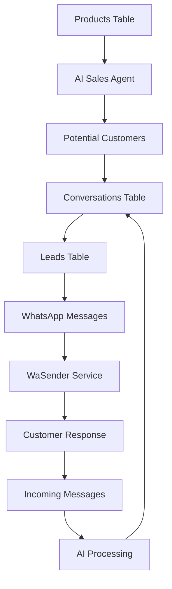

# Cron Jobs Technical Guide

## Overview
The SafariChat system uses Laravel's built-in task scheduling to automate various WhatsApp messaging processes, AI sales agent tasks, and system maintenance. This guide provides a technical walkthrough of how the cron job system works.

## Table of Contents
1. [System Architecture](#system-architecture)
2. [Main Cron Job Entry Point](#main-cron-job-entry-point)
3. [Data Flow Overview](#data-flow-overview)
4. [Detailed Process Flow](#detailed-process-flow)
5. [AI Sales Agent Workflow](#ai-sales-agent-workflow)
6. [WhatsApp Message Processing](#whatsapp-message-processing)
7. [Database Schema Reference](#database-schema-reference)
8. [Troubleshooting](#troubleshooting)

## System Architecture

```
┌─────────────────┐    ┌──────────────────┐    ┌─────────────────┐
│   Laravel       │    │   Queue System   │    │   WaSender      │
│   Scheduler     │───▶│   (Redis/DB)     │───▶│   API           │
│                 │    │                  │    │                 │
└─────────────────┘    └──────────────────┘    └─────────────────┘
         │                        │                       │
         ▼                        ▼                       ▼
┌─────────────────┐    ┌──────────────────┐    ┌─────────────────┐
│   Database      │    │   Log Files      │    │   WhatsApp      │
│   Updates       │    │   Monitoring     │    │   Recipients    │
└─────────────────┘    └──────────────────┘    └─────────────────┘
```

## Main Cron Job Entry Point

### File: `app/Console/Kernel.php`

The Laravel scheduler is the main entry point for all automated tasks. It runs every minute via the system cron:

```bash
# System crontab entry
* * * * * cd /path-to-your-project && php artisan schedule:run >> /dev/null 2>&1
```

### Key Scheduled Tasks

1. **Message Processing** (Every minute)
   ```php
   $schedule->call(function () {
       (new Message())->process();
   })->everyMinute();
   ```

2. **Daily Reminders** (Daily at 8:40 AM)
   ```php
   $schedule->call(function () {
       $this->reminders();
   })->dailyAt('08:40');
   ```

3. **AI Tasks** (Various intervals)
   ```php
   $this->scheduleAiTasks($schedule);
   ```

4. **Scheduled Followups** (Every minute)
   ```php
   $schedule->call(function () {
       $this->processScheduledFollowups();
   })->everyMinute();
   ```

## Data Flow Overview

### 1. Sales Process Data Flow



### 2. Database Table Relationships

#### Core Tables for Sales Process:
- `products` - Product catalog
- `ai_sales_agents` - AI agent configurations
- `leads` - Customer information
- `conversations` - Chat history
- `incoming_messages` - Received messages
- `outgoing_messages` - Sent messages
- `whatsapp_instances` - WaSender instances

## Detailed Process Flow

### Step 1: System Initialization

When cron runs, the system:

1. **Loads Environment**: Reads `.env` configuration
2. **Connects to Database**: Establishes MySQL connection
3. **Initializes Services**: 
   - WaSenderService
   - AiWhatsAppService
   - NotificationService

### Step 2: Message Processing Flow

#### Starting a Sales Campaign

1. **Product Detection**
   ```sql
   SELECT * FROM products WHERE status = 'active' AND ai_enabled = 1;
   ```

2. **Target Audience Identification**
   ```sql
   SELECT * FROM leads 
   WHERE status IN ('new', 'interested') 
   AND last_contact_at < NOW() - INTERVAL 24 HOUR;
   ```

3. **AI Agent Assignment**
   ```sql
   SELECT * FROM ai_sales_agents 
   WHERE user_id = ? AND status = 'active'
   ORDER BY priority DESC LIMIT 1;
   ```

4. **Message Generation**
   - AI generates personalized message using product data
   - Message stored in `conversations` table
   - Queued for delivery

5. **Message Delivery**
   ```php
   // Queue message for sending
   SendWhatsAppMessage::dispatch(
       $message,
       $phoneNumber,
       'whatsapp',
       $userId,
       null,
       $instanceId
   )->delay(now()->addSeconds($delay));
   ```

### Step 3: Customer Response Processing

When customer replies:

1. **Webhook Reception**
   ```
   POST /api/wasender/webhook/{instanceId}
   ↓
   WaSenderController@handleWebhook()
   ```

2. **Message Storage**
   ```sql
   INSERT INTO incoming_messages (
       phone_number, message_body, chat_id, 
       message_timestamp, user_id, instance_id
   ) VALUES (?, ?, ?, ?, ?, ?);
   ```

3. **AI Processing**
   ```php
   // Process the incoming message
   $aiService = app(AiWhatsAppService::class);
   $response = $aiService->processIncomingMessage($incomingMessage);
   ```

4. **Response Generation**
   - AI analyzes customer intent
   - Generates appropriate response
   - Updates conversation history
   - Schedules follow-up if needed

5. **Response Delivery**
   ```sql
   INSERT INTO outgoing_messages (
       phone_number, message, message_type, 
       status, instance_id, sent_at
   ) VALUES (?, ?, ?, ?, ?, ?);
   ```

## AI Sales Agent Workflow

### Process Schedule

#### Every Minute Tasks:
- Process scheduled followups
- Check for new incoming messages
- Send queued responses

#### Every 5 Minutes:
- Process failed messages
- Retry failed deliveries

#### Every 30 Minutes (Business Hours):
- Check overdue handoffs
- Auto-assign pending conversations

#### Daily Tasks:
- Update lead scores
- Send daily summaries
- Clean up old data

### AI Decision Making Process

1. **Message Analysis**
   ```php
   // Analyze customer intent
   $intent = $aiService->analyzeIntent($message);
   
   // Possible intents:
   // - product_inquiry
   // - price_request
   // - purchase_intent
   // - complaint
   // - general_question
   ```

2. **Response Strategy**
   ```php
   switch ($intent) {
       case 'product_inquiry':
           return $this->handleProductInquiry($message, $lead);
       case 'price_request':
           return $this->handlePriceRequest($message, $lead);
       case 'purchase_intent':
           return $this->handlePurchaseIntent($message, $lead);
   }
   ```

3. **Follow-up Scheduling**
   ```sql
   UPDATE conversations 
   SET followup_scheduled_at = ?, 
       followup_message = ?
   WHERE id = ?;
   ```

## WhatsApp Message Processing

### Outgoing Message Flow

1. **Message Creation**
   ```php
   $waSenderService = new WaSenderService();
   $result = $waSenderService->sendTextMessage(
       $phoneNumber,
       $message,
       $instanceId,
       $userId
   );
   ```

2. **API Call to WaSender**
   ```
   POST https://wasender.co.tz/api/instances/{instanceId}/messages/text
   Headers:
   - Authorization: Bearer {API_KEY}
   - Content-Type: application/json
   
   Body:
   {
       "phone": "255123456789",
       "message": "Hello, interested in our products?"
   }
   ```

3. **Response Logging**
   ```sql
   INSERT INTO outgoing_messages (
       user_id, phone_number, message, message_type,
       status, instance_id, message_id, api_response,
       sent_at, created_at
   ) VALUES (?, ?, ?, ?, ?, ?, ?, ?, ?, ?);
   ```

### Incoming Message Flow

1. **Webhook Reception**
   ```
   WaSender → POST /api/wasender/webhook/{instanceId}
   ```

2. **Message Parsing**
   ```php
   $webhookData = $request->all();
   $eventType = $webhookData['event'] ?? 'message';
   
   switch ($eventType) {
       case 'message':
           return $this->handleIncomingMessage($webhookData, $instance);
   }
   ```

3. **Database Storage**
   ```sql
   INSERT INTO incoming_messages (
       phone_number, message_body, message_type,
       chat_id, message_id, message_timestamp,
       user_id, instance_id, status
   ) VALUES (?, ?, ?, ?, ?, ?, ?, ?, 'received');
   ```

4. **AI Processing Queue**
   ```php
   ProcessIncomingMessage::dispatch($incomingMessage)
       ->onQueue('ai_standard');
   ```

## Database Schema Reference

### Key Tables and Their Purpose

#### `products`
- Stores product catalog
- Fields: name, description, price, category, ai_enabled
- Used by AI to generate product recommendations

#### `ai_sales_agents`
- AI agent configurations per user
- Fields: user_id, name, personality, product_focus, status
- Controls AI behavior and responses

#### `leads`
- Customer information and status
- Fields: phone_number, name, status, source, score
- Tracks customer journey and engagement

#### `conversations`
- Chat history between AI and customers
- Fields: lead_id, message, sender_type, ai_agent_id
- Maintains conversation context

#### `incoming_messages`
- All received WhatsApp messages
- Fields: phone_number, message_body, chat_id, status
- Raw message data from customers

#### `outgoing_messages`
- All sent WhatsApp messages
- Fields: phone_number, message, status, sent_at
- Delivery tracking and history

#### `whatsapp_instances`
- WaSender instance configurations
- Fields: instance_id, user_id, status, phone_number
- Manages WhatsApp connections

### Relationship Diagram

```
users (1) ──── (∞) ai_sales_agents
  │                    │
  │                    │
  └── (∞) whatsapp_instances
  │                    │
  │                    └── (∞) outgoing_messages
  │
  └── (∞) products
           │
           └── (∞) conversations ──── (∞) leads
                         │              │
                         │              └── (∞) incoming_messages
                         │
                         └── (∞) outgoing_messages
```

## Configuration Files

### Environment Variables

Required `.env` settings:
```env
# WaSender Configuration
WASENDER_BASE_URL=https://wasender.co.tz/api
WASENDER_API_KEY=your_api_key_here
WASENDER_DEFAULT_INSTANCE_ID=your_instance_id

# AI Configuration
OPENAI_API_KEY=your_openai_key
OPENAI_MODEL=gpt-4o

# Queue Configuration
QUEUE_CONNECTION=redis
REDIS_HOST=127.0.0.1
```

### Queue Configuration

#### File: `config/ai_queues.php`
```php
'connections' => [
    'ai_priority' => ['timeout' => 60],
    'ai_standard' => ['timeout' => 120],
    'ai_bulk' => ['timeout' => 300],
]
```

## Troubleshooting

### Common Issues

#### 1. Messages Not Sending
```bash
# Check queue status
php artisan queue:work --queue=high_priority,messages --verbose

# Check instance status
php artisan tinker
>>> App\Services\WaSenderService::isInstanceReady('instance_id')
```

#### 2. AI Not Responding
```bash
# Check AI configuration
php artisan tinker
>>> App\Models\AiSalesAgent::where('status', 'active')->get()

# Check OpenAI connection
>>> app(App\Services\OpenAiService::class)->testConnection()
```

#### 3. Webhook Not Working
```bash
# Check webhook URL configuration
php artisan route:list | grep webhook

# Check incoming message logs
tail -f storage/logs/laravel.log | grep webhook
```

### Debug Commands

#### Check System Status
```bash
# Overall system health
php artisan ai:manage-agents --agent-health-check

# Queue status
php artisan queue:monitor

# Failed jobs
php artisan queue:failed
```

#### Manual Testing
```bash
# Send test message
php artisan tinker
>>> $service = new App\Services\WaSenderService();
>>> $service->sendTextMessage('255123456789', 'Test message');

# Process specific message
>>> $message = App\Models\IncomingMessage::find(1);
>>> app(App\Services\AiWhatsAppService::class)->processIncomingMessage($message);
```

## Performance Monitoring

### Key Metrics to Monitor

1. **Message Delivery Rate**
   ```sql
   SELECT 
       DATE(sent_at) as date,
       COUNT(*) as total_sent,
       SUM(CASE WHEN status = 'delivered' THEN 1 ELSE 0 END) as delivered,
       (SUM(CASE WHEN status = 'delivered' THEN 1 ELSE 0 END) * 100.0 / COUNT(*)) as delivery_rate
   FROM outgoing_messages 
   WHERE sent_at >= DATE_SUB(NOW(), INTERVAL 7 DAY)
   GROUP BY DATE(sent_at);
   ```

2. **AI Response Time**
   ```sql
   SELECT AVG(TIMESTAMPDIFF(SECOND, created_at, updated_at)) as avg_response_time
   FROM conversations 
   WHERE sender_type = 'ai' 
   AND created_at >= DATE_SUB(NOW(), INTERVAL 24 HOUR);
   ```

3. **Queue Backlog**
   ```bash
   php artisan queue:monitor --queue=ai_standard,messages
   ```

### Alerting Thresholds

- Delivery rate < 90%
- AI response time > 30 seconds
- Queue backlog > 1000 jobs
- Failed job rate > 5%

## Security Considerations

### Webhook Security

1. **Verify Webhook Source**
   ```php
   public function handleWebhook(Request $request, $instanceId)
   {
       $signature = $request->header('X-WaSender-Signature');
       $expectedSignature = hash_hmac('sha256', $request->getContent(), config('services.wasender.webhook_secret'));
       
       if (!hash_equals($expectedSignature, $signature)) {
           abort(403, 'Invalid signature');
       }
   }
   ```

2. **Rate Limiting**
   ```php
   Route::middleware('throttle:60,1')->group(function () {
       Route::post('/wasender/webhook/{instanceId}', 'WaSenderController@handleWebhook');
   });
   ```

### Data Privacy

1. **Message Encryption**
   - Store sensitive customer data encrypted
   - Use Laravel's built-in encryption for PII

2. **Data Retention**
   - Automatically delete old conversations after 90 days
   - Anonymize customer data for analytics

3. **Access Control**
   - Implement proper authentication for API endpoints
   - Use role-based permissions for admin functions

## Scaling Considerations

### Horizontal Scaling

1. **Queue Workers**
   ```bash
   # Run multiple queue workers
   php artisan queue:work --queue=ai_standard --sleep=3 --tries=3 --max-time=3600 &
   php artisan queue:work --queue=messages --sleep=1 --tries=3 --max-time=3600 &
   ```

2. **Database Optimization**
   ```sql
   -- Add indexes for better performance
   CREATE INDEX idx_incoming_messages_phone_timestamp ON incoming_messages(phone_number, message_timestamp);
   CREATE INDEX idx_conversations_lead_created ON conversations(lead_id, created_at);
   CREATE INDEX idx_leads_status_updated ON leads(status, updated_at);
   ```

3. **Caching Strategy**
   ```php
   // Cache frequently accessed data
   Cache::remember('active_agents_' . $userId, 3600, function () use ($userId) {
       return AiSalesAgent::where('user_id', $userId)->where('status', 'active')->get();
   });
   ```

### Load Balancing

1. **Separate Read/Write Operations**
2. **Use Redis for Session Storage**
3. **Implement Database Replication**

This documentation provides a comprehensive technical overview of how the cron job system works in the SafariChat application. Each component is designed to work together to provide automated WhatsApp sales and customer engagement capabilities.