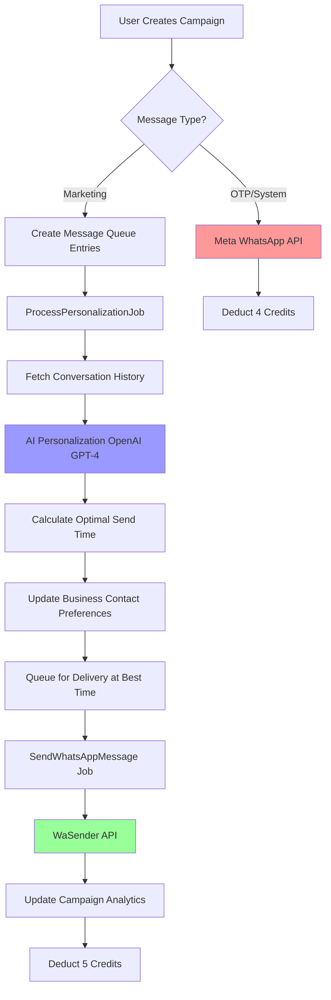

# Advanced Messaging: Hyper-Personalized Engagement System

**Version:** 2.1 (Updated: Table Structure Clarification)  
**Date:** February 27, 2026  
**Status:** Ready for Implementation

---

## 📢 Important: Database Table Structure

**CRITICAL:** This system uses the **modern table architecture**:

✅ **USE THESE TABLES:**
- `conversations` - Master table for ALL messages (incoming + outgoing)
- `incoming_messages` - WhatsApp webhook data with metadata
- `outgoing_messages` - Delivery tracking, status, billing
- `campaigns` + `message_queue` - NEW campaign system (to be created)

❌ **DEPRECATED TABLE:**
- `messages` - Legacy table being phased out

**Migration:** See [MESSAGES_TABLE_REMOVAL_PLAN.md](MESSAGES_TABLE_REMOVAL_PLAN.md) for complete replacement strategy.

---

## Executive Summary

Transform SafariChat from a **"Blast Messaging"** tool (one-to-many) into a **"Hyper-Personalized Engagement Platform"** (one-to-one at scale). This system uses AI to analyze each recipient's conversation history, language preference, tone, and relationship stage, then rewrites the core message to create a personalized experience for every contact—automatically.

**Current State:** User sends generic message → System queues jobs → Messages sent immediately  
**Target State:** User sends template message → AI analyzes each contact → System personalizes & schedules optimally → Messages sent at best time with contextual content

**Important:** Meta WhatsApp Business API is used **ONLY for OTP/system messages** (verification codes, password resets). All marketing/campaign messages use **WaSender API** to avoid Meta's strict template approval requirements and restrictions.

---

## ⚡ QUICK REFERENCE CARD FOR DEVELOPERS

```
╔══════════════════════════════════════════════════════════════╗
║             PROVIDER ROUTING - CRITICAL RULES                ║
╠══════════════════════════════════════════════════════════════╣
║                                                              ║
║  📱 OTP / Password Reset  →  Meta WhatsApp API (4 credits)  ║
║  📣 Campaign / Marketing  →  WaSender API (3 credits)       ║
║  🤖 AI Personalization    →  +2 credits (applies to both)   ║
║                                                              ║
║  ❌ NEVER use Meta for campaigns (instant ban risk!)        ║
║  ✅ ALWAYS use WaSender for marketing messages              ║
║                                                              ║
╠══════════════════════════════════════════════════════════════╣
║  Total Cost Per Campaign Message: 5 credits                 ║
║  (2 AI personalization + 3 WaSender send)                   ║
╚══════════════════════════════════════════════════════════════╝
```

**Complete Flow Diagram:**



---

## 1. Business Objectives

### 1.1 Primary Goals
- **Increase Engagement Rates:** Move from 15-30% read rates to 60-80% through hyper-personalization
- **Prevent Account Bans:** Reduce spam flags by making every message contextually relevant
- **Scale 1-to-1 Conversations:** Enable businesses to send 1000+ messages that feel like individual conversations
- **Maximize Conversion:** Use historical context to align messaging with customer journey stage

### 1.2 Success Metrics
- **Message Read Rate:** Target 70%+ (vs current ~25%)
- **Reply Rate:** Target 40%+ (vs current ~10%)
- **WhatsApp Account Health:** Zero spam flags/bans
- **Customer Sentiment:** 80%+ positive sentiment in responses
- **Conversion Rate:** 2x increase in sales from messaging campaigns

---

## 2. System Architecture: The Personalization Pipeline

### 2.0 WhatsApp Provider Strategy

**Critical Design Decision:**

SafariChat uses **two different WhatsApp providers** for different message types:

| Message Type | Provider | Reason |
|-------------|----------|--------|
| **OTP/System Messages** | **Meta WhatsApp Business API** | Official, secure, template-approved for transactional messages (OTP verification, password resets, account notifications) |
| **Campaign/Marketing Messages** | **WaSender API** | Flexible, no template restrictions, allows personalized content without pre-approval delays |

**Why NOT Meta for Campaigns?**
1. **Template Restrictions:** Meta requires pre-approved message templates for marketing content
2. **Approval Delays:** Each template takes 24-48 hours for Meta review
3. **Limited Personalization:** Templates have strict variable limitations
4. **High Ban Risk:** Sending non-approved content = instant account ban
5. **Cost:** Meta charges per template message (higher cost)

**Why WaSender for Campaigns?**
1. **No Template Required:** Send any personalized content instantly
2. **Full Personalization:** AI can freely customize messages per contact
3. **Lower Risk:** Unofficial API designed for bulk messaging
4. **Cost Effective:** 3 credits vs 4 credits (Meta)
5. **Proven Track Record:** Already handling SafariChat's current campaigns

**System Routing Logic:**
```php
if ($messageType === 'otp' || $messageType === 'password_reset') {
    // Use Meta WhatsApp Business API
    MetaWhatsAppService::sendOtpTemplate($phone, $code);
} else {
    // Use WaSender for all campaign/marketing messages
    WaSenderService::sendMessage($phone, $personalizedMessage);
}
```

**Visual Provider Routing:**

```
┌──────────────────────────────────────────────┐
│         WhatsApp Message Request             │
└─────────────────┬────────────────────────────┘
                  │
                  ▼
         ┌────────────────────┐
         │  Message Type?     │
         └────────┬───────────┘
                  │
        ┌─────────┴──────────┐
        │                    │
        ▼                    ▼
┌──────────────┐      ┌─────────────────┐
│ OTP/System   │      │ Campaign/       │
│ Messages     │      │ Marketing       │
└──────┬───────┘      └────────┬────────┘
       │                       │
       ▼                       ▼
┌──────────────┐      ┌─────────────────┐
│ Meta API     │      │ WaSender API    │
│ (Official)   │      │ (Flexible)      │
│ 4 credits    │      │ 3 credits       │
│ Template     │      │ No Template     │
│ Required     │      │ Full Freedom    │
└──────────────┘      └─────────────────┘
```

---

### 2.1 High-Level Flow

```
┌─────────────────────────────────────────────────────────────────────┐
│                    USER INITIATES CAMPAIGN                           │
│  • Selects recipients (All/Lead Status/Custom/Excel)                │
│  • Writes template message with hashtags (#name, #product)          │
│  • Attaches files/images (optional)                                 │
│  • Clicks "Send"                                                     │
└────────────────────────┬────────────────────────────────────────────┘
                         ▼
┌─────────────────────────────────────────────────────────────────────┐
│               STEP 1: CAMPAIGN STAGING                               │
│  • Create `campaigns` record                                         │
│  • Create `message_queue` entries for each recipient                │
│  • Upload attachments to storage                                    │
│  • Status: "staged"                                                  │
└────────────────────────┬────────────────────────────────────────────┘
                         ▼
┌─────────────────────────────────────────────────────────────────────┐
│          STEP 2: CONTACT CONTEXT RETRIEVAL (Per Recipient)          │
│  • Fetch last 10 messages from `conversations` table                │
│  • Fetch contact profile from `business_contacts`                   │
│  • Fetch lead status, products viewed, sentiment history            │
│  • Detect previous language used (English/Swahili/Mixed)            │
│  • Calculate engagement patterns (optimal send time)                │
│  • Status: "analyzing"                                               │
└────────────────────────┬────────────────────────────────────────────┘
                         ▼
┌─────────────────────────────────────────────────────────────────────┐
│              STEP 3: AI SENTIMENT FILTERING                          │
│  • Analyze last message sentiment                                   │
│  • Detect opt-out requests ("stop messaging", "not interested")    │
│  • Detect unresolved complaints/issues                              │
│  ├─ IF NEGATIVE: Move to "human_review" queue                       │
│  └─ IF POSITIVE/NEUTRAL: Continue to refinement                     │
└────────────────────────┬────────────────────────────────────────────┘
                         ▼
┌─────────────────────────────────────────────────────────────────────┐
│           STEP 4: AI MESSAGE PERSONALIZATION                         │
│  INPUT:                                                              │
│    • Original message template                                      │
│    • Contact history (last 10 messages)                             │
│    • Contact profile (name, phone, lead_status, products)           │
│    • Attachments metadata                                           │
│  PROCESSING:                                                         │
│    • Replace hashtags (#name, #product, etc.)                       │
│    • Detect preferred language (English/Swahili)                    │
│    • Analyze tone from history (Formal/Casual/Urgent)               │
│    • Identify relationship stage (New/Engaged/Converting/Customer)  │
│    • Check for pending questions in history                         │
│    • Contextualize attachments                                      │
│  OUTPUT:                                                             │
│    • Personalized message in contact's language & tone              │
│    • Optimal send time based on engagement patterns                 │
│    • Metadata (language, tone, confidence_score)                    │
│  • Status: "refined"                                                 │
└────────────────────────┬────────────────────────────────────────────┘
                         ▼
┌─────────────────────────────────────────────────────────────────────┐
│              STEP 5: INTELLIGENT SCHEDULING                          │
│  • Calculate best send time for this contact:                       │
│    - Analyze reply patterns (e.g., responds most 9-11 AM)           │
│    - Avoid late nights (after 9 PM)                                 │
│    - Spread messages over time (not all at once)                    │
│  • Schedule job for optimal time                                    │
│  • Status: "scheduled"                                               │
└────────────────────────┬────────────────────────────────────────────┘
                         ▼
┌─────────────────────────────────────────────────────────────────────┐
│              STEP 6: MESSAGE DELIVERY                                │
│  • SendWhatsAppMessage job executes at scheduled time               │
│  • Send via WaSender API (primary for campaigns)                    │
│  • Meta WhatsApp API used ONLY for OTP/system messages              │
│  • Log to `outgoing_messages` table                                 │
│  • Update billing (deduct credits)                                  │
│  • Status: "sent" or "failed"                                        │
└────────────────────────┬────────────────────────────────────────────┘
                         ▼
┌─────────────────────────────────────────────────────────────────────┐
│              STEP 7: CAMPAIGN ANALYTICS                              │
│  • Track delivery rates per campaign                                │
│  • Track read rates, reply rates                                    │
│  • Track sentiment of replies                                       │
│  • Generate campaign performance report                             │
└─────────────────────────────────────────────────────────────────────┘
```

---

## 3. Database Schema Design

### 3.1 New Tables

#### **Table: `campaigns`**
Master record for each messaging campaign.

| Column | Type | Description | Example |
|--------|------|-------------|---------|
| `id` | BIGINT | Primary key | 1 |
| `user_id` | BIGINT | Campaign creator | 45 |
| `business_id` | BIGINT | Business account | 12 |
| `campaign_name` | VARCHAR(255) | Auto-generated name | "Product Launch - Feb 27" |
| `campaign_type` | ENUM | 'broadcast', 'targeted', 'drip' | 'targeted' |
| `original_message` | TEXT | Template message | "Hi #name, check our #product!" |
| `recipient_criteria` | JSON | Filter criteria | `{"lead_status": "hot"}` |
| `total_recipients` | INT | Total contacts | 150 |
| `queued_count` | INT | Messages queued | 150 |
| `analyzing_count` | INT | Being analyzed | 50 |
| `refined_count` | INT | Personalized | 100 |
| `scheduled_count` | INT | Scheduled to send | 80 |
| `sent_count` | INT | Successfully sent | 120 |
| `failed_count` | INT | Failed sends | 5 |
| `human_review_count` | INT | Flagged for review | 25 |
| `status` | ENUM | 'staging', 'processing', 'scheduled', 'sending', 'completed', 'paused' | 'processing' |
| `has_attachments` | BOOLEAN | Files attached | true |
| `started_at` | TIMESTAMP | Campaign start time | '2026-02-27 09:00:00' |
| `completed_at` | TIMESTAMP | Campaign end time | '2026-02-27 12:35:00' |
| `created_at` | TIMESTAMP | Record creation | |
| `updated_at` | TIMESTAMP | Last update | |

**Indexes:**
- `idx_user_status` (user_id, status)
- `idx_created_at` (created_at)

---

#### **Table: `message_queue`**
Individual message record for each recipient in a campaign.

| Column | Type | Description | Example |
|--------|------|-------------|---------|
| `id` | BIGINT | Primary key | 1001 |
| `campaign_id` | BIGINT | Parent campaign | 1 |
| `user_id` | BIGINT | Message sender | 45 |
| `contact_id` | BIGINT | Recipient contact ID | 567 |
| `phone_number` | VARCHAR(20) | Recipient phone | '+255712345678' |
| `contact_name` | VARCHAR(255) | Contact name | 'John Doe' |
| `original_message` | TEXT | Template message | "Hi #name, check our #product!" |
| `refined_message` | TEXT | AI-personalized message | "Hi John, I saw you were interested in our Premium Plan last week. Here's the new pricing!" |
| `attachment_context` | TEXT | AI-generated attachment intro | "I've attached the discount flyer that fits your budget." |
| `status` | ENUM | 'staged', 'analyzing', 'refined', 'scheduled', 'sent', 'failed', 'human_review', 'opted_out' | 'refined' |
| `priority` | INT | Send priority (1-10) | 8 |
| `detected_language` | VARCHAR(10) | 'en', 'sw', 'mixed' | 'sw' |
| `detected_tone` | VARCHAR(20) | 'formal', 'casual', 'urgent', 'friendly' | 'casual' |
| `relationship_stage` | VARCHAR(20) | 'new', 'engaged', 'converting', 'customer', 'inactive' | 'engaged' |
| `last_interaction_at` | TIMESTAMP | Last message date | '2026-02-20 14:30:00' |
| `optimal_send_time` | TIMESTAMP | AI-calculated best send time | '2026-02-27 10:15:00' |
| `scheduled_send_at` | TIMESTAMP | Actual scheduled time | '2026-02-27 10:15:00' |
| `sent_at` | TIMESTAMP | Actual send time | '2026-02-27 10:15:23' |
| `ai_confidence_score` | DECIMAL(5,2) | AI personalization confidence | 0.87 |
| `sentiment_filter_result` | VARCHAR(20) | 'positive', 'neutral', 'negative', 'opt_out_detected' | 'neutral' |
| `human_review_reason` | TEXT | Why flagged for review | "Last message was a complaint" |
| `context_summary` | JSON | Historical context used | `{"last_product": "Premium Plan", "sentiment": "interested"}` |
| `ai_metadata` | JSON | AI processing details | `{"tokens_used": 450, "model": "gpt-4"}` |
| `retry_count` | INT | Send retry attempts | 0 |
| `error_message` | TEXT | Failure reason | |
| `external_message_id` | VARCHAR(255) | WhatsApp message ID | 'wamid.HBg...' |
| `provider` | VARCHAR(20) | 'wasender' (campaigns), 'meta' (OTP only) | 'wasender' |
| `credits_used` | INT | Billing credits | 5 |
| `created_at` | TIMESTAMP | Record creation | |
| `updated_at` | TIMESTAMP | Last update | |

**Indexes:**
- `idx_campaign_status` (campaign_id, status)
- `idx_scheduled_send` (scheduled_send_at, status)
- `idx_contact` (contact_id)
- `idx_optimal_time` (optimal_send_time)

---

#### **Table: `campaign_attachments`**
Store attachment files for campaigns.

| Column | Type | Description | Example |
|--------|------|-------------|---------|
| `id` | BIGINT | Primary key | 1 |
| `campaign_id` | BIGINT | Parent campaign | 1 |
| `file_name` | VARCHAR(255) | Original filename | 'discount_flyer.jpg' |
| `file_path` | VARCHAR(500) | Storage path | 'storage/campaigns/2026/02/abc123.jpg' |
| `file_url` | VARCHAR(500) | Public URL | 'https://safarichat.ai/storage/campaigns/2026/02/abc123.jpg' |
| `file_type` | VARCHAR(50) | MIME type | 'image/jpeg' |
| `file_size` | BIGINT | Size in bytes | 2048576 |
| `created_at` | TIMESTAMP | Upload time | |
| `updated_at` | TIMESTAMP | Last update | |

**Indexes:**
- `idx_campaign` (campaign_id)

---

#### **Table: `campaign_analytics`**
Track performance metrics per campaign.

| Column | Type | Description | Example |
|--------|------|-------------|---------|
| `id` | BIGINT | Primary key | 1 |
| `campaign_id` | BIGINT | Campaign reference | 1 |
| `total_sent` | INT | Messages sent | 145 |
| `total_delivered` | INT | Delivery confirmations | 142 |
| `total_read` | INT | Read receipts | 110 |
| `total_replied` | INT | Responses received | 58 |
| `avg_response_time` | INT | Avg response time (minutes) | 45 |
| `positive_sentiment_count` | INT | Positive replies | 52 |
| `neutral_sentiment_count` | INT | Neutral replies | 4 |
| `negative_sentiment_count` | INT | Negative replies | 2 |
| `opt_out_count` | INT | Unsubscribe requests | 1 |
| `conversion_count` | INT | Sales/conversions | 12 |
| `revenue_generated` | DECIMAL(10,2) | Total revenue | 4500.00 |
| `credits_spent` | INT | Total credits used | 725 |
| `roi` | DECIMAL(10,2) | Return on investment | 517.24 |
| `created_at` | TIMESTAMP | Record creation | |
| `updated_at` | TIMESTAMP | Last update | |

**Indexes:**
- `idx_campaign` (campaign_id) UNIQUE

---

### 3.2 Modified Tables

#### **Table: `business_contacts`** (Add columns)

| New Column | Type | Description |
|------------|------|-------------|
| `preferred_language` | VARCHAR(10) | 'en', 'sw', 'mixed' (auto-detected) |
| `preferred_tone` | VARCHAR(20) | 'formal', 'casual' (from history) |
| `last_message_sentiment` | VARCHAR(20) | 'positive', 'neutral', 'negative' |
| `opt_out_status` | BOOLEAN | Has requested no messages |
| `opt_out_at` | TIMESTAMP | When they opted out |
| `avg_reply_hour` | INT | Hour of day they usually reply (0-23) |
| `engagement_score` | DECIMAL(5,2) | 0-100 engagement rating |

---

#### **Table: `outgoing_messages`** (Add columns)

| New Column | Type | Description |
|------------|------|-------------|
| `campaign_id` | BIGINT | Parent campaign reference |
| `message_queue_id` | BIGINT | Queue record reference |
| `original_message` | TEXT | Template before personalization |
| `is_personalized` | BOOLEAN | Was AI-personalized |
| `personalization_metadata` | JSON | AI refinement details |

---

## 4. AI Message Personalization Logic

### 4.1 AI Prompt Template for Message Refinement

```
# SYSTEM ROLE
You are an expert Sales Communication Specialist with 15 years of experience in WhatsApp marketing. Your job is to personalize a template message for a specific customer based on their interaction history.

# CONTEXT INPUTS
**Contact Name:** {{contact_name}}
**Contact Phone:** {{contact_phone}}
**Lead Status:** {{lead_status}} (e.g., "hot", "warm", "cold", "customer")
**Relationship Stage:** {{relationship_stage}} (e.g., "new", "engaged", "converting")

**Conversation History (Last 10 Messages):**
{{conversation_history}}

**Original Template Message:**
{{original_message}}

**Attachments Included:**
{{attachment_list}}

# ANALYSIS TASKS
1. **Language Detection:** Analyze the conversation history to determine if this contact prefers:
   - English (formal/informal)
   - Swahili (formal/informal)
   - Code-switching (English + Swahili mix)

2. **Tone Analysis:** Based on previous messages, determine this contact's communication style:
   - Formal (uses full sentences, proper grammar)
   - Casual (uses abbreviations, emojis, informal tone)
   - Urgent (responds to time-sensitive language)
   - Friendly (appreciates personal touches)

3. **Context Awareness:** Check if there are:
   - Unanswered questions from the contact
   - Pending issues or complaints
   - Previous product interests mentioned
   - Recent purchase history

4. **Sentiment Check:** Determine the last message sentiment:
   - Positive (interested, engaged, happy)
   - Neutral (informational, transactional)
   - Negative (frustrated, complaint, disinterest)

# TRANSFORMATION RULES

## Rule 1: Language Matching
- If conversation history is 80%+ English → Use English
- If conversation history is 80%+ Swahili → Use Swahili
- If mixed → Use the language from their last 2 messages

## Rule 2: Tone Matching
- If they use formal language → Match formality
- If they use casual language → Be conversational
- If urgent situation detected → Be direct and action-oriented

## Rule 3: Personalization Elements
REQUIRED:
- Replace #name with actual contact name
- Replace #product with relevant product they viewed
- Replace #company with business name

OPTIONAL (if context supports):
- Reference specific conversation from history
- Acknowledge pending questions/issues
- Mention timeframe since last interaction
- Reference previous product interests

## Rule 4: Attachment Contextualization
If attachments are included:
- Explain WHY you're sending this specific file to THIS person
- Connect it to their previous interests/questions
- Make it feel like you selected it just for them

Example:
- Bad: "Hi John, here's a flyer"
- Good: "Hi John, I saw you asked about pricing last week—I've attached our new discount flyer that fits your budget"

## Rule 5: Preserve Core Message
- NEVER change the main offer, product, or call-to-action
- Keep promotional content intact
- Maintain all links/phone numbers exactly as provided

## Rule 6: Sentiment-Based Adjustments
- If last sentiment is NEGATIVE → Add empathy, acknowledge concern
- If last sentiment is NEUTRAL → Be informative and helpful
- If last sentiment is POSITIVE → Be enthusiastic and encouraging

# OUTPUT FORMAT
Provide your response as JSON:

{
  "detected_language": "en|sw|mixed",
  "detected_tone": "formal|casual|urgent|friendly",
  "relationship_stage": "new|engaged|converting|customer|inactive",
  "sentiment_score": 0.75,
  "confidence_score": 0.85,
  "refined_message": "Your personalized message here",
  "attachment_context": "Optional: Why you're sending this attachment",
  "reasoning": "Brief explanation of personalization choices",
  "red_flags": ["List any concerns: complaints, opt-out requests, etc."],
  "optimal_send_time_suggestion": "morning|afternoon|evening",
  "should_send": true|false,
  "human_review_required": false,
  "human_review_reason": "Optional: Why it needs review"
}

# CRITICAL CONSTRAINTS
- Output ONLY valid JSON, no additional text
- refined_message must be 500 characters or less (WhatsApp best practice)
- If you detect opt-out language ("stop", "unsubscribe", "don't message"), set should_send: false
- If last message was a complaint, set human_review_required: true
- Maintain professional standards—no offensive or overly aggressive language
```

---

## 5. Integration with Existing Workflow

### 5.1 Current Workflow (Before)

**File:** `resources/views/message/index.blade.php` → Form submission

**Tables Affected (Sequential):**
1. `conversations` - Create message record (stores all chat messages)
2. `message_attachments` - Store files
3. `message_recipients` - Create recipient records
4. `jobs` - Queue SendWhatsAppMessage jobs
5. `message_recipients` - Update status after send
6. `outgoing_messages` - Log sent messages with delivery status
7. `billing_accounts` - Deduct credits
8. `whatsapp_instances` - Update usage stats

**Current Table Structure:**
- `conversations` - Master table for all messages (incoming + outgoing)
- `incoming_messages` - WhatsApp webhook data and metadata
- `outgoing_messages` - Delivery tracking, status, billing info

**Problem:** No personalization, no optimal timing, no sentiment filtering

---

### 5.2 New Workflow (After Integration)

**File:** `resources/views/message/index.blade.php` → Enhanced form with "Personalize with AI" toggle

**Tables Affected (Sequential):**

1. **`campaigns`** - Create campaign record
   ```php
   Campaign::create([
       'user_id' => auth()->id(),
       'business_id' => auth()->user()->business_id,
       'campaign_name' => 'Product Launch - ' . now()->format('M d'),
       'original_message' => $request->message,
       'recipient_criteria' => $request->criteria,
       'total_recipients' => count($recipients),
       'status' => 'staging'
   ]);
   ```

2. **`campaign_attachments`** - Upload files
   ```php
   foreach ($request->files as $file) {
       CampaignAttachment::create([
           'campaign_id' => $campaign->id,
           'file_name' => $file->getClientOriginalName(),
           'file_path' => $file->store('campaigns/' . now()->format('Y/m')),
           'file_type' => $file->getMimeType(),
           'file_size' => $file->getSize()
       ]);
   }
   ```

3. **`message_queue`** - Create queue entries for each recipient
   ```php
   foreach ($recipients as $contact) {
       MessageQueue::create([
           'campaign_id' => $campaign->id,
           'user_id' => auth()->id(),
           'contact_id' => $contact->id,
           'phone_number' => $contact->phone,
           'contact_name' => $contact->name,
           'original_message' => $request->message,
           'status' => 'staged'
       ]);
   }
   ```

4. **Queue `ProcessPersonalizationJob`** - For each message_queue entry
   ```php
   ProcessPersonalizationJob::dispatch($messageQueue);
   ```

5. **Within `ProcessPersonalizationJob`:**
   
   a. **Fetch from `conversations`** - Get last 10 messages
   ```php
   $history = Conversation::where('lead_id', $lead->id)
       ->orderBy('created_at', 'desc')
       ->limit(10)
       ->get();
   ```
   
   b. **Fetch from `business_contacts`** - Get contact profile
   ```php
   $contact = BusinessContact::with('lead')->find($messageQueue->contact_id);
   ```
   
   c. **Call AI API** - Personalize message
   ```php
   $personalization = MessagePersonalizationService::personalize(
       $messageQueue->original_message,
       $contact,
       $history
   );
   ```
   
   d. **Update `message_queue`** - Store refined message
   ```php
   $messageQueue->update([
       'refined_message' => $personalization['refined_message'],
       'detected_language' => $personalization['detected_language'],
       'detected_tone' => $personalization['detected_tone'],
       'ai_confidence_score' => $personalization['confidence_score'],
       'optimal_send_time' => $this->calculateOptimalTime($contact),
       'status' => $personalization['should_send'] ? 'refined' : 'human_review'
   ]);
   ```
   
   e. **Update `business_contacts`** - Learn preferences
   ```php
   $contact->update([
       'preferred_language' => $personalization['detected_language'],
       'preferred_tone' => $personalization['detected_tone'],
       'last_message_sentiment' => $personalization['sentiment_score'] > 0.5 ? 'positive' : 'neutral'
   ]);
   ```

6. **Queue `SendWhatsAppMessage`** - Scheduled at optimal time
   ```php
   SendWhatsAppMessage::dispatch($messageQueue)
       ->delay($messageQueue->optimal_send_time);
   ```

7. **Within `SendWhatsAppMessage` job:**
   
   a. **Update `message_queue`** - Mark as sending
   ```php
   $messageQueue->update(['status' => 'sending']);
   ```
   
   b. **Send via WaSender API** - Using refined_message (Meta is ONLY for OTP)
   ```php
   // For campaign messages, use WaSender (not Meta)
   $response = WaSenderService::sendMessage(
       $messageQueue->phone_number,
       $messageQueue->refined_message  // ← Use personalized version
   );
   
   // Meta WhatsApp API is reserved ONLY for OTP/system messages
   // Marketing/campaign messages use WaSender to avoid template restrictions
   ```
   
   c. **Create `outgoing_messages`** - Log delivery
   ```php
   OutgoingMessage::create([
       'campaign_id' => $messageQueue->campaign_id,
       'message_queue_id' => $messageQueue->id,
       'user_id' => $messageQueue->user_id,
       'phone_number' => $messageQueue->phone_number,
       'message' => $messageQueue->refined_message,
       'original_message' => $messageQueue->original_message,
       'is_personalized' => true,
       'external_id' => $response['message_id'],
       'status' => 'sent'
   ]);
   ```
   
   d. **Update `message_queue`** - Mark as sent
   ```php
   $messageQueue->update([
       'status' => 'sent',
       'sent_at' => now(),
       'external_message_id' => $response['message_id']
   ]);
   ```
   
   e. **Update `campaigns`** - Increment counters
   ```php
   $campaign->increment('sent_count');
   ```
   
   f. **Update `billing_accounts`** - Deduct credits
   ```php
   BillingAccount::where('user_id', $messageQueue->user_id)
       ->decrement('ai_credits', 5); // 2 for AI + 3 for WaSender send
   ```
   
   g. **Update `campaign_analytics`** - Track metrics
   ```php
   CampaignAnalytics::updateOrCreate(
       ['campaign_id' => $campaign->id],
       ['total_sent' => DB::raw('total_sent + 1')]
   );
   ```

---

## 6. Enhanced Features (World-Class Level)

### 6.1 Best-Time-to-Send Algorithm
**Status:** High Priority

**Implementation:**
```php
protected function calculateOptimalSendTime(BusinessContact $contact): Carbon
{
    // If contact has established reply pattern
    if ($contact->avg_reply_hour) {
        $targetHour = $contact->avg_reply_hour;
    } else {
        // Analyze conversation history
        $replyHours = Conversation::where('lead_id', $contact->lead->id)
            ->where('sender_type', 'customer')
            ->get()
            ->pluck('created_at')
            ->map(fn($dt) => $dt->hour)
            ->mode(); // Most common hour
        
        $targetHour = $replyHours ?? 10; // Default to 10 AM
    }
    
    $sendTime = now()->hour($targetHour)->minute(rand(0, 59));
    
    // If time has passed today, schedule for tomorrow
    if ($sendTime->isPast()) {
        $sendTime->addDay();
    }
    
    // Avoid late nights (9 PM - 8 AM)
    if ($targetHour >= 21 || $targetHour < 8) {
        $sendTime->hour(10); // Default to 10 AM
    }
    
    return $sendTime;
}
```

---

### 6.2 Sentiment-Based Filtering
**Status:** Critical

**Implementation in AI Prompt:**
```json
{
  "red_flags": [
    "Last message contains 'stop messaging'",
    "Unresolved complaint about billing",
    "Expressed frustration in last 2 messages"
  ],
  "should_send": false,
  "human_review_required": true,
  "human_review_reason": "Contact requested to stop receiving messages"
}
```

**Backend Handling:**
```php
if ($personalization['should_send'] === false) {
    $messageQueue->update([
        'status' => 'human_review',
        'human_review_reason' => $personalization['human_review_reason']
    ]);
    
    // Notify user
    $user->notify(new MessageRequiresReviewNotification($messageQueue));
    
    return; // Don't schedule send
}
```

---

### 6.3 Attachment Contextualization
**Status:** Medium Priority

**Example Transformation:**

| Scenario | Original | AI-Personalized |
|----------|----------|-----------------|
| Contact asked about pricing | "Hi #name, check this flyer" | "Hi John, you asked about our pricing last week. I've attached our new discount flyer—20% off for the next 3 days!" |
| First-time contact | "Hi #name, see our catalog" | "Hi Sarah, welcome! I've attached our product catalog. Since you're interested in office furniture, check out page 3 for standing desks." |
| Returning customer | "Hi #name, new products!" | "Hi Michael, great to hear from you! Since you bought the Premium Plan last month, I'm excited to share our new Enterprise features (attached)." |

---

## 7. Implementation Roadmap

### Phase 1: Foundation (Week 1-2)
- [ ] Create database migrations for `campaigns`, `message_queue`, `campaign_attachments`, `campaign_analytics`
- [ ] Add columns to `business_contacts` and `outgoing_messages`
- [ ] Build `Campaign` and `MessageQueue` models with relationships
- [ ] Update message form UI to support campaign creation

### Phase 2: AI Integration (Week 3-4)
- [ ] Build `MessagePersonalizationService` class
- [ ] Integrate OpenAI API (or Azure OpenAI)
- [ ] Create `ProcessPersonalizationJob` queue job
- [ ] Test AI prompt with 50 different conversation scenarios
- [ ] Fine-tune prompt for Swahili language support

### Phase 3: Scheduling & Delivery (Week 5-6)
- [ ] Implement optimal send time calculation algorithm
- [ ] Update `SendWhatsAppMessage` job to use `refined_message`
- [ ] Build scheduling queue with Laravel's `delay()` feature
- [ ] Create human review dashboard for flagged messages
- [ ] Add bulk approve/skip actions

### Phase 4: Analytics & Optimization (Week 7-8)
- [ ] Build campaign analytics tracking system
- [ ] Create campaign performance dashboard
- [ ] Implement reply sentiment analysis
- [ ] Add ROI calculation (revenue / credits_spent)
- [ ] Build A/B testing framework (personalized vs. generic)

---

## 8. Success Criteria

### 8.1 Technical Metrics
- [ ] 100% of messages personalized by AI (no generic blasts)
- [ ] <2 second AI processing time per message
- [ ] 95%+ message queue processing success rate
- [ ] Zero campaign failures due to system errors
- [ ] 99%+ uptime for personalization pipeline

### 8.2 Business Metrics
- [ ] 70%+ message read rates (vs current ~25%)
- [ ] 40%+ reply rates (vs current ~10%)
- [ ] 2x increase in conversion rates
- [ ] Zero WhatsApp account bans/flags
- [ ] 80%+ positive sentiment in responses
- [ ] 30%+ reduction in opt-out/unsubscribe requests

### 8.3 User Experience
- [ ] One-click campaign launch (< 3 clicks from form to send)
- [ ] Real-time campaign progress tracking
- [ ] Human review queue cleared in <5 minutes
- [ ] Intuitive analytics dashboard
- [ ] Mobile-responsive campaign management

---

## 9. Billing & Credits

### 9.1 Credit Calculation

| Action | Credits | Notes |
|--------|---------|-------|
| AI Personalization | 2 credits/message | OpenAI API call cost |
| WhatsApp Send (WaSender) | 3 credits/message | Primary for campaigns |
| WhatsApp Send (Meta) | 4 credits/message | ONLY for OTP/system messages |
| **Total per campaign message** | **5 credits** | 2 (AI) + 3 (WaSender Send) |
| **Total per OTP message** | **6 credits** | 2 (AI if personalized) + 4 (Meta Send) |

### 9.2 Billing Workflow

1. **Campaign Creation:** Calculate total cost = `recipients × 5 credits` (2 for AI + 3 for WaSender)
2. **Pre-flight Check:** Verify user has sufficient credits
3. **Reserve Credits:** Lock credits for campaign
4. **Per Personalization:** Deduct 2 credits from locked amount
5. **Per Send (WaSender):** Deduct 3 credits from locked amount
6. **Failed Sends:** Refund 3 send credits (keep 2 AI credits if personalization completed)
7. **Campaign Completion:** Release any unused reserved credits

**Note:** OTP messages use Meta API (4 credits for send) and are handled separately from campaigns.

---

## 10. Next Steps

1. **Review & Approve** this requirements document with stakeholders
2. **Estimate Effort** for each phase (suggest 8 weeks total)
3. **Set up OpenAI API** account and test prompts with real data
4. **Create Database Migrations** for all new tables
5. **Build MVP** with 10 test contacts before scaling
6. **Pilot Program** with 3 beta customers for 2 weeks
7. **Full Launch** with comprehensive documentation

---

## 11. Appendix: Database Relationship Diagram

### Core Messaging Tables:

```
users (1) ───── (Many) campaigns
                    │
                    ├─── (Many) message_queue
                    │         │
                    │         └─── (1) business_contacts
                    │                   │
                    │                   └─── (1) leads ───── (Many) conversations
                    │         
                    ├─── (Many) campaign_attachments
                    │
                    └─── (1) campaign_analytics

message_queue (Many) ───── (Many) outgoing_messages

billing_accounts (1) ───── (Many) billing_transactions

leads (1) ───── (Many) incoming_messages
          ───── (Many) outgoing_messages
          ───── (Many) conversations
```

### Table Purpose Clarification:

| Table | Purpose | Contains |
|-------|---------|----------|
| `conversations` | **Master chat history** | ALL messages (customer→business, business→customer, AI→customer) |
| `incoming_messages` | **WhatsApp webhook data** | Customer incoming messages with metadata (media URLs, message IDs) |
| `outgoing_messages` | **Delivery tracking** | Sent messages with status, provider, billing info |
| `campaigns` | **Campaign metadata** | Bulk send campaigns with analytics |
| `message_queue` | **Personalization queue** | AI-refined messages waiting to send |

**Note:** The legacy `messages` table has been **deprecated** and replaced with the above structure. See `MESSAGES_TABLE_REMOVAL_PLAN.md` for migration details.

---

## 12. CRITICAL IMPLEMENTATION WARNINGS

### ⚠️ WARNING 1: NEVER Use Meta API for Campaign Messages

**DO NOT:**
```php
// ❌ WRONG - This will get your Meta account BANNED
MetaWhatsAppService::sendTextMessage($phone, $campaignMessage);
```

**DO:**
```php
// ✅ CORRECT - Use WaSender for campaigns
WaSenderService::sendMessage($phone, $campaignMessage);
```

**Why?** Meta requires pre-approved templates for marketing. Sending unapproved content = instant ban.

---

### ⚠️ WARNING 2: Message Type Routing

Always check message type before selecting provider:

```php
// In SendWhatsAppMessage job
public function handle()
{
    // Determine message type
    $isSystemMessage = in_array($this->messageType, [
        'otp_verification',
        'password_reset',
        'account_notification',
        'system_alert'
    ]);
    
    if ($isSystemMessage) {
        // System messages → Meta API (official, secure)
        $this->sendViaMetaWhatsAppApi();
    } else {
        // Campaign/marketing → WaSender (flexible, personalized)
        $this->sendViaUnifiedApi(); // Uses WaSender
    }
}
```

---

### ⚠️ WARNING 3: Meta Template Approval Required

If you ever need to use Meta for marketing:

1. **Create Template** in Meta Business Manager
2. **Submit for Approval** (24-48 hours wait)
3. **Use ONLY Approved Template Name** in API calls
4. **Never Send Unapproved Content**

Example approved template:
```
Name: campaign_announcement
Category: MARKETING
Body: "Hi {{1}}, check out our {{2}} - {{3}}% off today!"
Status: APPROVED
```

Usage:
```php
MetaWhatsAppService::sendTemplate(
    phoneNumber: '+255712345678',
    templateName: 'campaign_announcement', // Must be pre-approved
    languageCode: 'en',
    components: [
        ['type' => 'body', 'parameters' => [
            ['type' => 'text', 'text' => 'John'],
            ['type' => 'text', 'text' => 'Premium Plan'],
            ['type' => 'text', 'text' => '20']
        ]]
    ]
);
```

**Current Status:** SafariChat has NO approved marketing templates in Meta. All campaigns MUST use WaSender.

---

### ⚠️ WARNING 4: Credit Calculations

**Campaign Messages:**
- AI Personalization: 2 credits
- WaSender Send: 3 credits
- **Total: 5 credits/message**

**OTP Messages:**
- AI Personalization: 0 credits (uses template)
- Meta Send: 4 credits
- **Total: 4 credits/message**

**DO NOT** mix up the credit calculations or users will be overcharged/undercharged.

---

### ⚠️ WARNING 5: Testing Strategy

**Before deploying to production:**

1. **Test OTP Flow:** Verify Meta API works for OTP only
   ```bash
   php artisan tinker
   >>> app(App\Services\MetaWhatsAppService::class)->sendOtpTemplate('+255XXXXXXXXX', '123456');
   ```

2. **Test Campaign Flow:** Verify WaSender works for personalized messages
   ```bash
   >>> app(App\Services\WaSenderService::class)->sendMessage('+255XXXXXXXXX', 'Hi John, custom message here');
   ```

3. **Never Test Marketing Messages via Meta** - Use sandbox/test numbers with WaSender only

---

**Document Version:** 2.1 (Table Structure Clarification)  
**Last Updated:** February 27, 2026  
**Author:** SafariChat Development Team  
**Status:** Ready for Implementation  
**Breaking Changes:** 
- **v2.0:** Meta WhatsApp Business API is now RESTRICTED to OTP/system messages only. All campaign/marketing messages MUST use WaSender API.
- **v2.1:** Deprecated `messages` table - Use `conversations`, `incoming_messages`, `outgoing_messages` instead. See MESSAGES_TABLE_REMOVAL_PLAN.md for migration guide.
